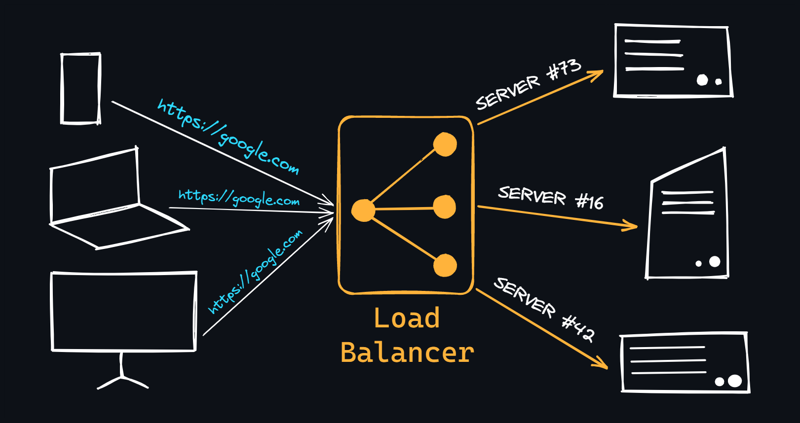

## Caching

Keeping a subset of some primary data depending on various parameters at some location which is faster to access and is easier to retrieve data.

Parameters:

- Usage of that data
- Frequency of usage
- Probability of next usage

Caching is used to avoid repetition of expensive computation and/or sending large amounts of data to many users.

**Cache Hit** - If the data being looked for is found in the cache, then it's called cache hit.

### Levels of Caching

#### Network Level

Use cases:

- Content Delivery Network (CDN) - The idea is to cache content which is geographically closer to the end user. Being close to the user minimizes the amount of latency and resources of the server.
  - The CDN's DNS resolves the request into an IP, routes it to the nearest point of presence (PoP) for users to load videos with minimum amount of buffering.
  - The PoP checks if the requested content is in the cache or not.
  - If it's in the cache then it's a _cache hit_ and the content is sent to the user, else it's a _cache miss_ and the responsible edge server fetches the content / resource from the originating server.

- ## Domain Name Server (DNS) -
  - Say, `example.com` is typed in url bar in the user's device (laptop/mobile). The device sends it to a recursive resolver, which is provided by the user's ISP or a public DNS provider (like Cloudflare).
  - Recursive Resolver -
    - It first checks whether that particular IP is in the cache resulting in a _cache hit_ else it's a _cache miss_
    - If it's a _cache miss_, the query is sent to root servers
    - Root Servers -
      - Search for the appropriate TLD based on the query - **example.com** has `.com`, the query reaches the address of .com
      - The TLD contains the authoritative name server for **example.com** which then retrieves the ip
    -

Since DNS does all this work for every single request, most operating systems maintain a local cache for DNS. When a user requests a particular domain, before the query is sent to recursive resolver:

- the OS checks its local cache first. If IP is found, it is returned
- the next level of cache is in browser. Browsers maintain their own local ip address cache. If IP is found, it is returned
- the next level of cache is in recursive resolver. If IP is found, it is returned

**Point of Presence (PoP)** - a collection of edge servers
**Time To Live (TTL)** - how long to keep a particular content in the cache. If TTL expires then the content is refetched from the originating server.
**Top Level Domains (TLD)** - contains addresses of top level domains like .com, .co, .in
**Redis** - it is called in-memory cache because data is stored in RAM

#### Hardware Level

CPU caches (L1, L2, L3) are small, fast memory layers built directly into the processor that store frequently accessed instructions and data. L1 is the fastest and smallest (closest to the core), while L3 is larger but slower and shared across cores. This reduces the number of trips to main RAM, which is significantly slower.

#### Software Level

Software-level caching happens within the application or infrastructure layer — examples include in-memory stores like Redis or Memcached, query result caches in databases, and HTTP response caches. Unlike hardware caches, these are explicitly managed by developers and can be tuned based on access patterns, TTL, and eviction policies.

**Eviction Policy**

Decides how to let go of old data in cache to clear space for newly incoming data.

- No Eviction - no eviction policy is configured

- Least Recently Used (LRU) - removes the item which was accessed least recently when the cache is full and a new item needs to be inserted. It operates on the assumption that data used recently is more likely to be used again soon.

- Least Frequently Used (LFU) - apart from tracking when was the key generated, it also tracks how many times is the data called.

- TTL

### Caching Strategies

#### Lazy Cache (Cache-Aside)

A pattern where the content is cached when an API requests for it.

When a client requests a resource, the corresponding server checks if the resources is available in the cache. If it is, the resource is returned from the cache. Else, it fetches the data from a different storage, stores it in the cache and then return the cache.

#### Write Through

Everytime something changes (POST, PUT, PATCH, DELETE), the database is updated along with the cache. This ensures that the cache remains always fresh

### Use Cases

- Database Query Caching - content which is read heavy operation and written infrequently.
- Session Tokens - stored in cache (redis) instead of database.
- API Caching - Cache 3rd party api content to reduce rate limit
- Rate Limiting Mechanism - implemented in a middleware which takes a custom header to find the public ip address of client. A counter can be implemented to limit the number of times this client call the API. This counter is stored in redis

Reference - [Backend From First Principles](https://www.youtube.com/watch?v=0Rwb4Xmlcwc&list=PLui3EUkuMTPgZcV0QhQrOcwMPcBCcd_Q1)

---

### Load Balancing



When the traffic is high, it becomes difficult for a single server running a maximally optimized application to handle the traffic. At this point, we need to distribute the load across multiple machines/servers.

A load balancer is a device that distributes the load across multiple servers. The load balances is placed between the client and the servers. It receives the traffic from the client and forwards it to the appropriate server.

#### Key Concepts for Interviews

*   **Algorithms**:
    *   *Round Robin*: Routes requests sequentially.
    *   *Least Connections*: Routes requests to the server with the fewest active connections (best for database or long-lived tasks).
    *   *IP Hash*: Hashes the client's IP to assign a server (ensures a client always hits the same server).
*   **Rate Limiting & Protection**: Implementing rate limits at the load balancer level (e.g., limiting connections per IP) shields the backend application servers from DDoS attacks and resource exhaustion.

#### Setup Example (Nginx as a Load Balancer)

```nginx
# 1. Define the upstream backend server pool
upstream my_backend_cluster {
    least_conn; # Use the Least Connections algorithm
    server 10.0.0.1:8000;
    server 10.0.0.2:8000;
}

# 2. Configure the server block to proxy traffic
server {
    listen 80;
    server_name example.com;

    location / {
        proxy_pass http://my_backend_cluster;
        
        # Pass headers so the backend knows the real client's IP
        proxy_set_header Host $host;
        proxy_set_header X-Real-IP $remote_addr;
        proxy_set_header X-Forwarded-For $proxy_add_x_forwarded_for;
    }
}
```

Reference - [Backend Cheat Sheet](https://github.com/cheatsnake/backend-cheats#load-balancing)