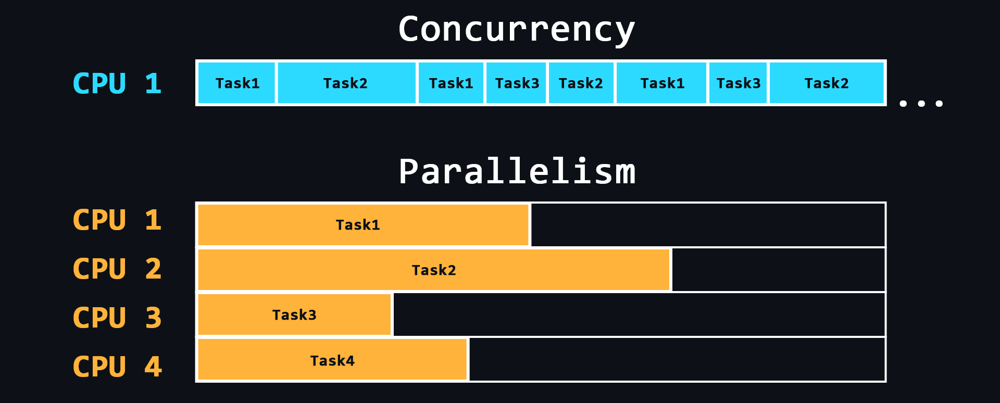

## Concurrency And Parallelism

### Core Concepts

Reference - [Backend Cheat Sheat](https://github.com/cheatsnake/backend-cheats/blob/master/files/os/concurrency-parallel.png)

#### Concurrency vs. Parallelism
* **Concurrency** is about **structure**. It is the ability to handle multiple tasks by interleaving their execution (making progress on more than one task at a time, e.g., time-sharing on a single CPU core).
* **Parallelism** is about **execution**. It is the ability to run multiple tasks simultaneously at the exact same physical instant (which requires multiple CPU cores).

> **Analogy:** 
> * **Concurrency:** A single chef chopping onions, then stirring the soup, then checking the oven. They are managing multiple tasks sequentially.
> * **Parallelism:** Three chefs in the kitchen, each doing one of those tasks at the exact same time.

Most backend web applications are **I/O-bound** (waiting on databases, disk reads, or external API calls) rather than CPU-bound (doing heavy mathematical computations, video processing, or cryptography).

---

### Implementation Models

There are three primary models to handle concurrency in backend servers:

#### 1. Thread-per-Request (Multi-Threading)
Traditionally used by frameworks like Java (Spring Boot/Tomcat) or Python (Django/WSGI).
* **How it works:** The server spawns or assigns a dedicated OS thread for every incoming connection/request.
* **How it handles I/O:** When a request needs to query the database, the thread **blocks** (goes to sleep) and waits for the database response. The operating system context-switches to another thread that is ready to run.
* **Pros:** Highly intuitive to write and debug (code executes sequentially from top to bottom).
* **Cons (Overhead):**
  * **Memory:** Every OS thread allocates a fixed stack (typically ~1MB). High concurrency (e.g., 10,000 active connections) requires gigabytes of memory just for thread stacks.
  * **Thread Creation:** Spawning new OS threads is expensive. (Mitigated by using **Thread Pools**).
  * **Context Switching:** Switching between thousands of active threads consumes significant CPU overhead.

#### 2. Single-Threaded Event Loop (Asynchronous Non-blocking)
Used by technologies like Node.js (JavaScript), Redis, and Nginx.
* **How it works:** A single main thread runs in a continuous loop, executing tasks and handling events from a queue.
* **How it handles I/O:** When I/O is required, the thread registers a callback with the operating system and immediately moves to the next request. Once the OS finishes the I/O, the callback is put into the task queue, and the event loop executes it when free.
* **Pros:** Extremely lightweight, highly scalable for I/O-bound tasks, and requires minimal memory.
* **Cons (The Golden Rule):** **Never block the event loop.** If a task performs heavy CPU-bound computation (e.g., password hashing, image processing), it blocks the entire thread. This prevents any other requests or callbacks from processing.

#### 3. Virtual Threads / Coroutines (Lightweight Threads)
The modern paradigm used in Go (Goroutines), Java 21+ (Virtual Threads), Kotlin (Coroutines), and Erlang (Processes).
* **How it works:** The runtime manages lightweight "virtual" threads in user space and maps thousands of them onto a small pool of actual OS threads.
* **How it handles I/O:** When a virtual thread blocks on I/O, the runtime automatically "parks" it and runs another virtual thread on the underlying OS thread.
* **Pros:** The "best of both worlds." You write simple, synchronous-looking code (no complex callbacks or promises), but achieve the massive scalability and low memory usage of an event loop.

---

### Race Conditions & Thread Safety

A **race condition** occurs when multiple threads concurrently read and write to a shared memory location, and at least one access is a write, without proper synchronization. This leads to unpredictable and corrupted data.

#### How to Prevent Race Conditions

1. **Shared-Memory Synchronization (Locks)**
   * **Mutex (Mutual Exclusion):** A lock that ensures only one thread can access a "critical section" of code/data at a time.
   * **Semaphore:** A counter-based lock that limits concurrent access to a fixed pool of resources (e.g., database connection pool).
   * **Read-Write Lock:** Allows multiple threads to read concurrently, but only one thread to write (blocking all readers).

2. **Message-Passing (Share Nothing)**
   Instead of sharing memory and using locks to protect it, threads communicate by sending messages through **Channels** (Go) or using the **Actor Model** (Erlang/Akka). This avoids shared state completely.
   > **Proverb:** *"Do not communicate by sharing memory; instead, share memory by communicating."*