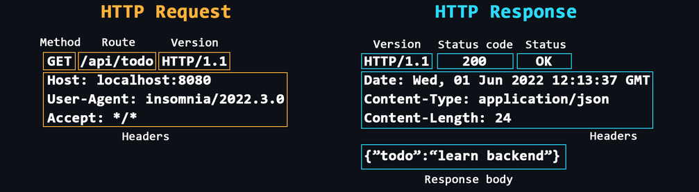

## HTTP Protocols

Two key characterstics - statelessness and client-server modeal

### Statelessness

- No memory of past interactions
- Each request carries all the necessary information for the server to process it -- self-contained request. After processing, the server forgets about the request.
- Simplifies server architecture as server doesn't need to store session information
- Scalability as it makes it easy to distribute requests across multiple servers, and no single server needs to track session details.

### Client-Server Model

Client initiates the communication

- Client initiates the communication by sending the request to the server.
- Server hosts resources like websites or apis. It waits for incoming requests from the client and serves the requested resource after processing the request
- For client and server to communicate, the client-server need to establish a connection mechanism. HTTP uses TCP for this.

### Message

Request and Response structure

#### Request Message

Sent by a client

- A request method
- A resource URL - location of the resource being requested from the server
- HTTP protocol version
- Hostname
- Headers
- Payload / Request body

#### Response Message

- HTTP version
- Status code and its value
- Date and time of the request
- Response headers (key-value pairs)
- Response Body



_Image reference: [Backend Cheats - HTTP Protocol](https://github.com/cheatsnake/backend-cheats#http-protocol)_

#### Headers

A different section is created for headers because it is metadata about the request. It's like the address and other details mentioned about the package.

**Request Headers** - Sent by the client to the server

- User Agent - identifies the type of client like browser, mobile app, postman, server, etc
- Authorization - Sends different credentials like bearer token to the server to identify the user
- Cookie -
- Accept - type of content accepted by the client like json, html, text file, etc

**General Headers** - Used in both, request and responses

- Date - date of the message
- Cache-control - different caching mechanisms like no-cache, max-age
- Connection - connection information like whether to keep it alive or close it

**Representation Headers** - Provides information about the body of the request/response ensuring the clients and servers know how to interpret and process it.

- Content-type - media type like json, html
- Content-length - size of the resource in bytes
- Content-encoding - specifies any encoding like gzip, deflate
- ETag - a unique identifier used for caching

**Security Headers** - Helps protect the client and server from a variety of attacks by controlling how the browser behaves with resources and enforcing security policies

- Strict-Transport-Security
- Content-Security-Policy
- X-Frame-Options
- X-Content-Type-Options
- Set-Cookie

**Characteristics of HTTP Headers**

- Extensibility - Headers can be easily added or customized without altering the underlying protocol. For eg, creating custom headers prefixed with "x-", content negotiation using accept to serve different versions of the content based on client's needs

- Remote Control - Client sends instructions to the server and the server responds with the appropriate resource in the desired format as per the specified instructions

### Methods

Define the intent of the action. Expresses the what of the request.

- GET
- POST
- PUT - Update data but completely replaces the previous instance of the data
- PATCH - Updates that specific instance of data
- DELETE

#### Idempotent

HTTP methods can be called multiple times and provide the same result in all calls

- GET - Data is same regardless of the number of times it is fetched
- PUT - As it completely replaces the data in the server, it doesn't matter how many times old data is replaced, the result will be the same
- DELETE - Once a resource is deleted, we can't delete that resource again. Idempotency here is that the act of deleting a resource occurs once. The same resource cannot be deleted again and hence gives the same result

#### Non-Idempotent

Result is different for same kind of request

- POST - As it creates a new data, the result is different for each request.

### Response Codes

Communicate the result of a request in a standardized way across servers and language.

- Information 1XX - Server received the headers and the client can proceed to send the request body. Commonly used in large uplaods.
- Success 2XX - Success responses:
  - 200 - request was successful and server is returning the desired resource or performing the intended action
  - 201 - request was successful and resulted in the creation of a new resources. eg. used in form subsmissions
  - 204 - request was successful but there's no content. Also used for DELETE sometimes
- Redirection 3XX - Redirection responses:
  - 301 - requested resource has been **moved permenantly** to a new route. Old routes are responded with 301
  - 302 - requested resource is temporarily located at a different url but the client should continue to use the original url for future requests
  - 304 - respirce not modified; resource has not been modified since the last time client has requested it so the client can used the cached response
- Client errors 4XX -
  - 400 - bad request; when client sends invalid data or something wrong in the request format
  - 401 - unauthorized; client has failed to provide valid credentials or is not authenticated at all for a request requiring authentication
  - 403 - forbidden; client (despite being authenticated) does not have the permission to perform this action
  - 404 - not found; client request a resource which is unavailable
  - 405 - method not found; invalid http request method
  - 409 - conflict; re-creation of a unique data instance like creating the folder with the same name
  - 429 - too many requests; rate limit the client request within a certain period
- Server error 5XX
  - 500 - internal server error
  - 501 - not implemented; currently this particular request has not been implemented in server and will be implemented soon
  - 502 - bad gateway; usually used in proxy servers
  - 503 - service is unavailable, for eg, during maintenance
  - 504 - gateway timeout; nginx failed to received a response from the original (upstream)

### Caching

Technique of caching to store copoies of responses for reuse reducing the need to do repeated request to the server. Improves load time, reduces bandwidth and decreases server load.

Server returns 304 if client is to continue to use the cached result. Else, the new result is provided.

Nowadays, caching has been shifted to client thanks to libraries like RTK Query

### Content Negotiations

Mechanism using which client and server agree on a compatible format to exchange data.

3 types:

- Media type - client specifies desired format through the `accept` header
- Language - client requests content in a specific language
- Encoding - client specifies which encoding it uses (gzip, deflate) and server responds with this encoding format

**Compression** - if the response size is very large, server can compress can the data into a specific format accepted by the client (like gzip, deflate) and, the client can de-compress it

### Persistent Connections and keep-alive

In HTTP 1.0, each request/response cycle required a separate connection to the server. This created inefficiencies as establishing and closing TCP connections is resource intensive and slow.
To address this, persistent connections was introduced in HTTP 1.1 using `keep-alive` header. This means that a single TCP connection can be reused for multiple request/response cycles until one of them decides to close it.

- Connections are persistent by default.
- `keep-alive` - explicitly close a connection

### Handling Large Requests and Responses

Client sends large files via multipart/form-data which sends the file in parts/ `boundary` header determines the delimeter

Receiving large responses - idea is to stream the data in chunks
`content-type: text/event-stream` is one example
`Connection: keep-alive`

Client appends each chunk and constructs the original data

### SSL

Original protocol to secure communications between client (web browser) and server. It encrypts data so that sensitive information like passwords cannot be intercepted by attackers. Outdated now.

### TLS

Modern and more secure version of SSL. Uses certificates to authenticate the server and
establish an encrypted connection preventing
eves dropping and data breaching.

### HTTPS

HTTP + more security using TLS. TLS encrypts the connection between client-server.

### Cross Origin Resource Sharing (CORS)

Used because browsers have a same-origin policy by default to restrict making requests to a domain different from the one serving the web-page.

**CORS** is a security mechanism enforced by browsers to control how web applications interact with resources hosted on different domains (origins).

#### Types of Flows

**Simple Request**
When a cross-origin request qualifies as "simple" (GET, POST, or HEAD method; only simple headers like Accept, Content-Type; simple Content-Types), the browser sends the request directly with the Origin header, skipping the preflight OPTIONS request. The server responds with Access-Control-Allow-Origin. If the origin matches (or \* is set), the browser allows JavaScript access to the response. If not, the request completes on the server but the browser blocks access to the response, resulting in a CORS error on the client.

**Pre-flight Request**
Apart from _Origin_ and server domain being different, to qualify as a pre-flight request, one of these 3 have to be true:

- Method is not GET, POST, or HEAD (e.g. PUT, DELETE)
- Request includes non-simple headers (like Authorization, X-Custom-Header)
- The request has a Content-Type other than `application/x-www-form-urlencoded`, `multipart/form-data`, `text/plain`.

Made using `OPTIONS` method.

**Browser Request**:

```http
OPTIONS /api/resource HTTP/1.1
Host: api.anotherdomain.com
Origin: https://example.com
Access-Control-Request-Method: PUT
Access-Control-Request-Headers: Authorization
```

Browser is making a cross-origin-request to the server at `api.anotherdomain.com` to ask whether it supports the `PUT` method for this route and asks whether `Authorization` header is supported.

**Server Response**:

```http
HTTP/1.1 204 No Content
Access-Control-Allow-Origin: https://example.com
Access-Control-Allow-Methods: PUT, DELETE
Access-Control-Allow-Headers: Authorization
Access-Control-Max-Age: 86400 // Server says the config specified will be same for 24 hrs (86400s) so don't make another request to me
```
