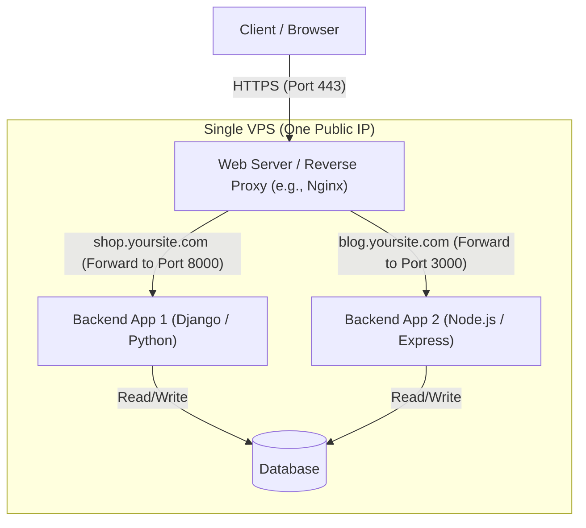

## High Level Understanding

The essence of backend is _data_ - what is the source of truth, where is it stored, how is it manipulated, how is it protected, when and were is it retrieved

### Request travel

1. Originates from a client (like browser)
2. Goes to DNS which then points to the AWS instance
3. Then reaches the AWS firewall which protects the traffic at infrastructure level
4. Next, the request reaches AWS instance where nginx is running. The nginx is a reverse proxy which points the request to the actual server-ip in the instance.
5. Finally, the request reaches the local server within an AWS instance.

### Why can't we do everything on Frontend and why do we need a backend?

- Security reasons - security policies of brwsers are very restricitive
- CORS issue
- Connection pool to databases - prevents connection/reconnection to databases on each request
- Higher computing power for business logic

Reference - [Backend From First Principles](https://www.youtube.com/watch?v=0Rwb4Xmlcwc&list=PLui3EUkuMTPgZcV0QhQrOcwMPcBCcd_Q1)

---

### Web Server vs. Backend (Application Server)

#### Definitions
*   **Web Server** (e.g., Nginx, Apache): Handles raw network-level HTTP requests, manages SSL/TLS certificates, serves static files (HTML, CSS, images) directly from disk, and acts as a gateway (reverse proxy) to shield your application.
*   **Backend / Application Server** (e.g., Django, Spring Boot, Express): Executes the actual application code, runs business logic, validates user data, and communicates with the database to generate dynamic responses (usually JSON).

#### Key Concepts Explained
*   **Built-in Web Servers**: Some languages (like PHP) historically could not run as long-running processes listening on network ports, requiring a dedicated web server (like Apache) to handle HTTP and execute the scripts. While modern backends (like Spring Boot with embedded Tomcat) do have built-in servers, placing a dedicated web server (like Nginx) in front of them remains standard practice for performance and security.
*   **Shared IP Routing**: A cloud instance gets exactly one public IP address and listens on standard web ports (`80` for HTTP, `443` for HTTPS). A web server on these ports acts as a **Reverse Proxy**, analyzing incoming request domains and routing them to the correct backend applications running on different internal ports.

Reference - [Backend Cheat Sheet](https://github.com/cheatsnake/backend-cheats#web-servers)