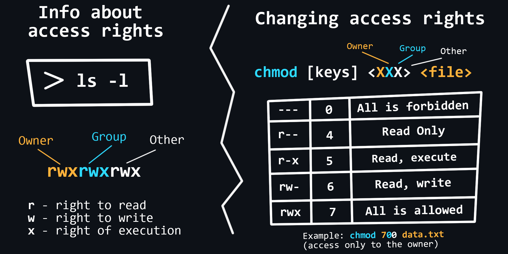
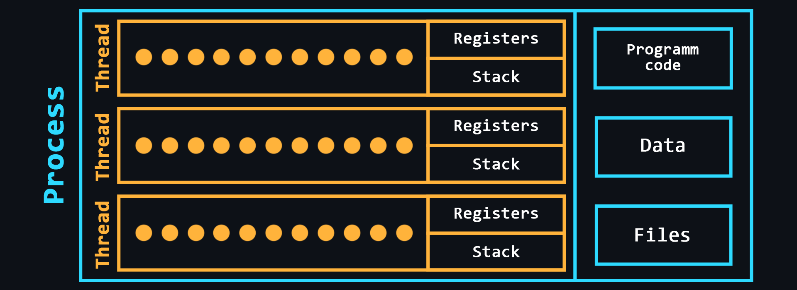
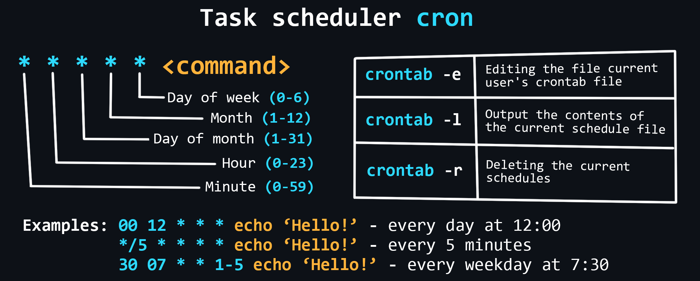

## Linux Essentials

### Commands



### Users, Group and Permissions

3 types of rights:

- Read
- Write
- Execute

3 categories of users to which rights are applied:

- file owner
- file group
- everyone else


### Processes

A process is a program that is currently being executed. It contains all information about the state of a running program. From the perspective of a backend developer, it is important to know about managing processes (creating, terminating, monitoring, etc.) to be able to deploy and maintain backend applications effectively.

Some commands:

```
ps # display a snapshot of the current process
top # real-time view of all currently running processes
jobs # list of processes running in the background
kill  [PID] # terminate the process by PID

```

A process contains:
- Executable program code
- Input and output data
- Call stack (order of instructions to execute)
- Heap to store variables dynamically created during the process
- Segment descriptor
- File descriptor
- Processor status information



**Thread** - 
A thread is a lightweight process, which is a single sequence of instructions that can be executed independently by a processor.
There can be multiple threads within a process. All threads within a process share the same code, data, and files, but each has its own stack and registers.


### Inter-Process Communication

A mechanism which allows to exchange data between threads of one or different processes running on the same or on different computers connected by a network.

Common mechanisms:
- File - One process writes data to a certain file while aonther process reads the same file, and thus receives the data from first.
- Signal (IPC) - Asynchronous notification of one process about an event which occurred in another process.
- Pipes - Redirecting the output of one process to the input of another process. 
- Message Queues - A collection of messages that are sent from one process and can be read by another process. The processes have to explicitly read and write the messages.
- Shared Memory - A mechanism which allows processes to share a block of memory.


### Secure Shell (SSH)

SSH allows remote access to another computer's terminal. It is widely used for accessing and managing servers, including deploying backend applications and monitoring their performance.

Basic commands:
```
apt install openssh-server # isntalling ssh
service ssh start # start ssh
service ssh stop # stop ssh

# Connect to a remote server
ssh -p [port] [user]@[remote_host_ip_address] # connecting to a remote machine via SSH


# Password less login
ssh-keygen -t rsa #generating public key 
ssh-copy-id [user]@[remote_host_ip_address] # copy public key to remote server

# Config files
/etc/ssh/sshd_config # ssh server global config
~/.ssh/config # ssh server local config
~/.ssh/authorized_keys # file with saved public keys
```

### Task Scheduler

Schedulers allow you to flexibly manage the delayed running of commands or scripts on your system. Linux has a built-in **cron** scheduler




---

Reference - [Backend Cheat Sheet by yurace](https://github.com/cheatsnake/backend-cheats#processes-and-threads)