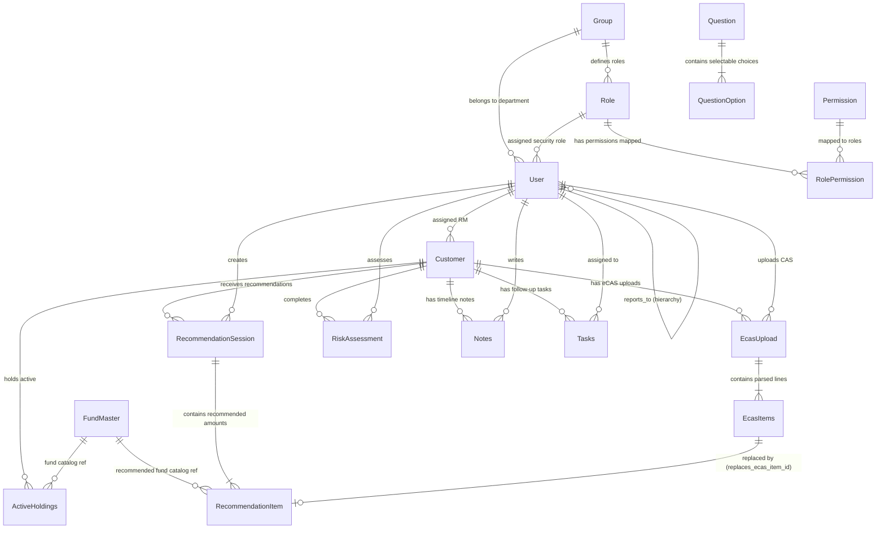

#### CRM Backend System Design Document (SSD)

### Table of Contents
1. [Introduction](#1-introduction)
   - 1.1 [Purpose](#11-purpose)
   - 1.2 [Scope](#12-scope)
   - 1.3 [Intended Audience](#13-intended-audience)
   - 1.4 [Definitions, Acronyms & Abbreviations](#14-definitions-acronyms-abbreviations)
   - 1.5 [Assumptions](#15-assumptions)
   - 1.6 [References](#16-references)
2. [Business Overview](#2-business-overview)
   - 2.1 [Business Domain](#21-business-domain)
   - 2.2 [Business Problem](#22-business-problem)
   - 2.3 [Stakeholders](#23-stakeholders)
   - 2.4 [Business Objectives](#24-business-objectives)
   - 2.5 [Customer Lifecycle](#25-customer-lifecycle)
3. [Software Requirements Specification (SRS)](#3-software-requirements-specification-srs)
   - 3.1 [Functional Requirements](#31-functional-requirements)
   - 3.2 [Non-Functional Requirements](#32-non-functional-requirements)
4. [High-Level Design (HLD)](#4-high-level-design-hld)
   - 4.1 [Architectural Style](#41-architectural-style)
   - 4.2 [Module Interaction View](#42-module-interaction-view)
   - 4.3 [Deployment Architecture](#43-deployment-architecture)
   - 4.4 [Technology Stack](#44-technology-stack)
   - 4.5 [Architectural Decisions (ADRs)](#45-architectural-decisions-adrs)
5. [Database Design](#5-database-design)
   - 5.1 [ER Diagram](#51-er-diagram)
   - 5.2 [Tables](#52-tables)
   - 5.3 [Relationships](#53-relationships)
   - 5.4 [Constraints](#54-constraints)
   - 5.5 [Indexing Strategy](#55-indexing-strategy)
6. [API Design](#6-api-design)
   - 6.1 [REST API Patterns](#61-rest-api-patterns)
   - 6.2 [Authentication APIs](#62-authentication-apis)
   - 6.3 [Customer Management APIs](#63-customer-management-apis)
   - 6.4 [Portfolio Management APIs](#64-portfolio-management-apis)
   - 6.5 [Portfolio Review APIs](#65-portfolio-review-apis)
   - 6.6 [Recommendation APIs](#66-recommendation-apis)
   - 6.7 [Risk Assessment APIs](#67-risk-assessment-apis)
   - 6.8 [Task Management APIs](#68-task-management-apis)
   - 6.9 [Notes APIs](#69-notes-apis)
   - 6.10 [User & Access Management APIs](#610-user--access-management-apis)
   - 6.11 [Error Response Format](#611-error-response-format)
7. [Low-Level Design (LLD)](#7-low-level-design-lld)
   - 7.1 [Package Structure](#71-package-structure)
   - 7.2 [Module Design](#72-module-design)
   - 7.3 [Authentication Module](#73-authentication-module)
   - 7.4 [Customer Module](#74-customer-module)
   - 7.5 [Portfolio Module](#75-portfolio-module)
   - 7.6 [Portfolio Review Module](#76-portfolio-review-module)
   - 7.7 [Risk Assessment Module](#77-risk-assessment-module)
   - 7.8 [Recommendation Module](#78-recommendation-module)
   - 7.9 [Task Management Module](#79-task-management-module)
   - 7.10 [Notes Module](#710-notes-module)
   - 7.11 [User & Access Management Module](#711-user--access-management-module)
8. [Security Design](#8-security-design)
   - 8.1 [Authentication](#81-authentication)
   - 8.2 [Authorization](#82-authorization)
   - 8.3 [JWT](#83-jwt)
   - 8.4 [Permission Model](#84-permission-model)
   - 8.5 [Threat Model](#85-threat-model)
9. [Asynchronous Processing](#9-asynchronous-processing)
   - 9.1 [eCAS Processing](#91-ecas-processing)
   - 9.2 [Recommendation Generation](#92-recommendation-generation)
   - 9.3 [Notifications](#93-notifications)
10. [Performance & Scalability](#10-performance--scalability)
    - 10.1 [Caching](#101-caching)
    - 10.2 [Pagination](#102-pagination)
    - 10.3 [Connection Pooling](#103-connection-pooling)
    - 10.4 [Database Optimization](#104-database-optimization)
11. [Deployment & Operations](#11-deployment--operations)
    - 11.1 [Environment Configuration](#111-environment-configuration)
    - 11.2 [Docker](#112-docker)
    - 11.3 [Logging](#113-logging)
    - 11.4 [Monitoring](#114-monitoring)
    - 11.5 [Backup & Recovery](#115-backup--recovery)
12. [Testing Strategy](#12-testing-strategy)
    - 12.1 [Unit Tests](#121-unit-tests)
    - 12.2 [Integration Tests](#122-integration-tests)
    - 12.3 [API Tests](#123-api-tests)
13. [Future Improvements](#14-future-improvements)
14. [Interview Notes](#15-interview-notes)

---

### 1. Introduction

#### 1.1 Purpose

This Software Design Document (SSD) provides a comprehensive design of the CRM backend system. It serves as the primary technical reference for understanding the system's architecture, design decisions, and implementation approach.

The document bridges the gap between business requirements and software implementation by describing:

- The business domain and the problems the system solves.
- The functional and non-functional requirements.
- The overall software architecture.
- The database design and domain model.
- The REST API contracts.
- The low-level component design.
- The security model.
- The deployment architecture.

It is intended to provide sufficient technical detail for developers, architects, testers, and reviewers to understand, implement, maintain, and extend the backend application.

#### 1.2 Scope

This Customer Relationship Management (CRM) system is designed for financial advisory firms operating in the mutual fund investment domain. It supports the day-to-day activities of Relationship Managers (RMs), Team Leads, Administrators, and other internal staff involved in acquiring, managing, and servicing investors.

The system provides end-to-end customer lifecycle management, including:

- Prospect creation and management.
- Conversion of prospects into investors.
- Customer profile and KYC document management.
- Risk assessment through a structured questionnaire.
- Portfolio review based on uploaded eCAS statements.
- Investment portfolio visualization and analysis.
- Investment recommendations derived from the customer's risk profile and portfolio review.
- Task management for each customer.
- Customer notes and activity tracking.

In addition to customer management, the CRM provides an administrative module for managing the organization's internal users. Administrators can create and manage users, define organizational groups (departments), assign roles, and configure role-based permissions to control access to different system functionalities.

This Software Design Document covers the complete backend design of the CRM application, including its business domain, architecture, database design, REST APIs, security model, and implementation details. The Calendar module is intentionally excluded from the scope of this document.

#### 1.3 Intended Audience

This Software Design Document is intended for stakeholders involved in the design, development, testing, deployment, and maintenance of the CRM backend application. It serves as a technical reference for understanding the system architecture and implementation.

The intended audience includes:

- Backend Developers
- Frontend Developers
- Software Architects
- QA Engineers
- DevOps Engineers
- Technical Reviewers
- Future Developers responsible for maintaining or extending the application

#### 1.4 Definitions, Acronyms & Abbreviations

| Term | Description |
|------|-------------|
| CRM | Customer Relationship Management System |
| RM | Relationship Manager responsible for managing customer relationships |
| Prospect | A potential customer who has not yet become an investor |
| Investor | A customer actively investing through the advisory firm |
| KYC | Know Your Customer verification documents |
| eCAS | Electronic Consolidated Account Statement used for portfolio analysis |
| NAV | Net Value of a mutual fund |
| MF | Mutual Fund |
| RBAC | Role-Based Access Control |
| JWT | JSON Web Token |
| REST | Representational State Transfer |
| API | Application Programming Interface |
| DTO | Data Transfer Object |
| ORM | Object Relational Mapping |
| JPA | Jakarta Persistence API |
| CRUD | Create, Read, Update and Delete |

#### 1.5 Assumptions

The backend system is designed based on the following assumptions:

- The application is intended for internal use by authorized employees of a financial advisory firm.
- Customer authentication is outside the scope of this system. Only firm employees can access the CRM.
- The frontend application communicates exclusively through REST APIs.
- Authentication is implemented using JWT-based stateless authentication.
- Authorization is enforced using Role-Based Access Control (RBAC).
- PostgreSQL is used as the primary relational database.
- The application is designed to support concurrent access by multiple users.
- Risk assessment scoring follows business-defined rules and questionnaires.
- Portfolio recommendations are generated using predefined business rules provided by the financial firm.

#### 1.6 References

The design of this backend system is based on the following references:

- CRM UI/UX Design Document.
- Latest CRM Frontend implementation (used as the source of truth for the Risk Assessment and Portfolio modules).
- Functional requirements gathered from business discussions and existing application behavior.
- Spring Boot 3.x Documentation.
- Java 21 Documentation.
- PostgreSQL Documentation.
- JWT (RFC 7519) Specification.
- REST API Design Best Practices.

### 2. Business Overview

#### 2.1 Business Domain

The CRM operates in the financial advisory domain, specifically within the mutual fund investment industry. Financial advisory firms assist customers in achieving their financial goals by recommending suitable investment products based on their financial profile, investment objectives, and risk appetite.

Relationship Managers (RMs) are responsible for acquiring new customers, understanding their financial requirements, performing risk assessments, reviewing existing investment portfolios, and providing personalized investment recommendations. The CRM acts as a centralized platform that enables these activities while maintaining customer information, investment data, and operational workflows.

#### 2.2 Business Problem

Managing customer relationships in a financial advisory firm involves multiple interconnected processes, including customer onboarding, KYC verification, risk profiling, portfolio analysis, investment recommendations, task management, and internal collaboration.

When these processes are managed manually or across multiple disconnected systems, organizations face several challenges:

- Customer information becomes fragmented across different platforms.
- Tracking customer progress throughout the investment lifecycle becomes difficult.
- Manual portfolio analysis is time-consuming and error-prone.
- Investment recommendations may become inconsistent across advisors.
- Administrative management of employees, roles, and permissions becomes difficult as the organization grows.
- Tracking follow-up tasks and customer interactions becomes inefficient.

The CRM addresses these challenges by providing a unified platform for managing customers, investment workflows, and internal operations.

#### 2.3 Stakeholders

The primary stakeholders of the CRM include:

| Stakeholder | Responsibilities |
|-------------|------------------|
| Relationship Manager (RM) | Manages prospects and investors, performs risk assessments, reviews portfolios, creates recommendations, maintains customer notes, and manages customer tasks. |
| Team Lead | Supervises Relationship Managers, monitors customer activities, and manages operational workflows. |
| Administrator | Manages users, roles, groups, permissions, and system configuration. |
| Customer (Indirect Stakeholder) | Receives investment advice and recommendations but does not directly access the CRM. |

#### 2.4 Business Objectives

The primary objectives of the CRM are:

- Centralize customer information and investment data.
- Streamline the customer onboarding process.
- Digitize KYC and customer documentation.
- Standardize risk assessment using predefined questionnaires.
- Enable efficient portfolio analysis through eCAS processing.
- Generate investment recommendations aligned with customer risk profiles.
- Improve customer servicing through task and note management.
- Simplify administration of users, roles, groups, and permissions.
- Improve operational efficiency across the organization.

#### 2.5 Customer Lifecycle

The CRM manages customers throughout their investment journey.

```text
Lead
    ↓
Prospect Created
    ↓
KYC Collection
    ↓
Risk Assessment
    ↓
Portfolio Review
    ↓
Investment Recommendation
    ↓
Investor
    ↓
Ongoing Portfolio Management
```

This lifecycle forms the foundation for the business workflows and software modules described in the following sections.

---

### 3. Software Requirements Specification (SRS)

The CRM backend shall provide the functional capabilities and quality attributes required to support customer lifecycle management, portfolio analysis, administrative operations, and secure access to the system.

#### 3.1 Functional Requirements

##### Authentication & Authorization

- Authenticate users using email and password credentials.
- Generate JWT access tokens upon successful authentication.
- Authorize API requests using Role-Based Access Control (RBAC).
- Restrict access to protected resources based on assigned roles and permissions.

##### Prospect Management

- Create, update, retrieve, and delete prospects.
- Search and filter prospects using various criteria.
- Assign prospects to Relationship Managers.
- Convert eligible prospects into investors.

##### Investor Management

- Manage investor profiles.
- Store personal, contact, and KYC information.
- Maintain investor lifecycle status.

##### Risk Assessment

- Present predefined risk assessment questionnaires.
- Record customer responses.
- Calculate and store customer risk profiles.
- Maintain assessment history.

##### Portfolio Review

- Upload customer eCAS statements.
- Process portfolio data.
- Display investment holdings and portfolio summaries.
- Maintain portfolio review history.

##### Investment Recommendations

- Generate investment recommendations based on customer risk profiles and portfolio analysis.
- Maintain recommendation history.

##### Task Management

- Create customer-related tasks.
- Assign tasks to users.
- Update task status.
- Track pending and completed tasks.

##### Notes Management

- Create, update, and retrieve customer notes.
- Associate notes with customers.

##### User Administration

- Create and manage users.
- Activate or deactivate user accounts.
- Manage employee profiles.

##### Group Management

- Create and manage organizational groups.
- Assign users to groups.

##### Role & Permission Management

- Create and manage roles.
- Configure permissions.
- Assign roles to users.
- Enforce authorization during API access.

##### Notifications

- Generate notifications for business events.
- Retrieve notification history.
- Mark notifications as read.

---

#### 3.2 Non-Functional Requirements

##### Performance

- The system shall provide low-latency responses for common CRUD operations.
- API response times should remain acceptable under normal operating loads.

##### Scalability

- The application shall support horizontal scaling through stateless REST APIs.
- Components shall remain loosely coupled to facilitate future scaling.

##### Security

- All protected APIs shall require authentication.
- Passwords shall be securely hashed before storage.
- Authorization shall be enforced using Role-Based Access Control (RBAC).
- All communication shall occur over HTTPS in production environments.

##### Reliability

- Business transactions shall maintain data consistency.
- Errors shall be handled gracefully with meaningful error responses.

##### Maintainability

- The application shall follow a layered architecture.
- Business logic shall remain independent of infrastructure concerns.
- The codebase shall adhere to established coding standards and SOLID principles where applicable.

##### Availability

- The system should remain available during normal business operations with minimal downtime.

##### Auditability

- Important business operations shall be logged for auditing and troubleshooting purposes.

### 4. High-Level Design (HLD)

#### 4.1 Architectural Style

The CRM backend follows a _Layered Modular Monolithic_ architecture. The application is packaged and deployed as a single Spring Boot application, while organizing business capabilities into independent functional modules: 
- Authentication
- Customer Management (Prospect + Investor)
- Risk Assessment
- Portfolio
- Portfolio Review
- User and Access Management (includes groups, roles and permissions)
- Task Management
- Customer Notes Management 
- Notifications.

To ensure strict modularity and facilitate future extraction into microservices if needed, we enforce the following rules:
- **Code Encapsulation:** Modules expose only public interfaces and Data Transfer Objects (DTOs) to other modules. Internal implementation details (such as entities, service implementations, and repositories) use Java's package-private visibility to prevent direct external access.
- **Database Partitioning:** While modules share a single PostgreSQL database, they own their respective tables. We explicitly prohibit SQL joins across module boundaries. Cross-module data dependencies are resolved at the application service layer using domain IDs.

The backend exposes RESTful APIs consumed by the React frontend. Authentication is implemented using JWT-based stateless authentication, and business data is persisted in PostgreSQL using Spring Data JPA (ORM).

This architecture was selected because the application is developed and maintained by a small team, minimizing operational complexity (avoiding distributed transactions, network overhead, and complex service orchestration). At the same time, the clean separation of concerns provides a clear migration path to a microservices architecture if specific domains (like Portfolio Review) scale independently in the future.


#### 4.2 Module Interaction View

```
                      Authentication
                             │
                             ▼
                    Customer Management
         ╱       ╱         │         ╲        ╲
        ▼       ▼          ▼          ▼        ▼
      Risk    Tasks      Notes    Portfolio Portfolio
   Assessment                         ▲     Review
        │                             │       ▲
        └─────────────────────────────►───────┘
```

#### 4.3 Deployment Architecture

#### 4.3 Deployment Architecture

The CRM backend is designed as a single deployable Spring Boot application hosted on the organization's AWS infrastructure. Client requests are routed through an AWS Application Load Balancer (ALB) and an Nginx reverse proxy before reaching the application. Business data is persisted in a PostgreSQL database.

This deployment model provides secure HTTPS communication, centralized request routing, and simplifies application deployment while supporting future horizontal scaling through additional application instances behind the load balancer.

```
                  Internet
                      │
                      ▼
                 Route 53
                      │
                      ▼
           Application Load Balancer
                      │
                      ▼
            ┌───────────────────────┐
            │       EC2:            │
            │                       │
            │  Nginx                │
            │     │                 │
            │     ▼                 │
            │ Spring Boot           │
            └─────┼─────────────────┘
                  │
                  ▼
         Amazon RDS PostgreSQL
```

#### 4.4 Technology Stack

```
| Category             | Technology                    |
| -------------------- | ----------------------------- |
| Programming Language | Java 21                       |
| Backend Framework    | Spring Boot 3.x               |
| Security             | Spring Security, JWT          |
| ORM                  | Spring Data JPA, Hibernate    |
| Database             | PostgreSQL (Amazon RDS)       |
| API Documentation    | OpenAPI / Swagger             |
| Build Tool           | Maven                         |
| Containerization     | Docker                        |
| Reverse Proxy        | Nginx                         |
| Cloud Platform       | AWS (EC2, ALB, Route 53, RDS) |
| Version Control      | Git, GitHub                   |
| Testing              | JUnit 5, Mockito              |

```

#### 4.5 Architectural Decisions (ADRs)


| Decision                          | Rationale                                                                                                                |
| --------------------------------- | ------------------------------------------------------------------------------------------------------------------------ |
| **Layered Modular Monolith**      | Chosen over microservices to reduce operational complexity while maintaining clear business module boundaries.           |
| **RESTful APIs**                  | Provides a standard, stateless interface between the React frontend and the backend.                                     |
| **JWT-based Authentication**      | Eliminates server-side session management and enables stateless request processing.                                      |
| **Spring Security**               | Provides a mature and extensible security framework with seamless JWT integration.                                       |
| **Spring Data JPA + Hibernate**   | Simplifies persistence through ORM while reducing boilerplate code.                                                      |
| **PostgreSQL**                    | Chosen for ACID compliance, strong relational modeling capabilities, and excellent Spring ecosystem support.             |
| **Amazon RDS**                    | Offloads database administration through managed backups, monitoring, patching, and high availability options.           |
| **Module Encapsulation**          | Business modules expose only DTOs and public interfaces, preventing tight coupling between domains.                      |
| **Database Ownership per Module** | Each module owns its tables to preserve domain boundaries and simplify future service extraction.                        |
| **No Cross-Module SQL Joins**     | Cross-domain interactions occur through application services rather than direct database coupling, improving modularity. |
| **Docker**                        | Provides consistent application packaging and simplifies deployment across environments.                                 |
| **Nginx Reverse Proxy**           | Handles request forwarding, security headers, compression, and acts as the entry point to the Spring Boot application.   |
| **AWS Deployment**                | Provides a scalable and production-ready hosting environment with managed infrastructure services.                       |

### 5. Database Design

#### 5.1 ER Diagram

##### Conceptual ER Diagram (Mermaid)



##### Relationship Mapping & Cardinality

* **Customer 1 ─── < Active Holdings**: One customer can hold multiple active mutual funds.
* **Fund Master 1 ─── < Active Holdings**: One mutual fund from the catalog can be held by multiple customers (resolving the many-to-many customer-to-fund relationship).
* **Customer 1 ─── < Ecas Upload**: One customer can upload multiple eCAS statements over time (audit history).
* **Ecas Upload 1 ─── < Ecas Items**: One uploaded CAS statement status contains multiple holding rows (cascade delete).
* **Customer 1 ─── < Recommendation Session**: One customer can receive multiple recommendation sets.
* **Recommendation Session 1 ─── < Recommendation Item**: One recommendation session contains multiple recommended allocations (cascade delete).
* **Fund Master 1 ─── < Recommendation Item**: One mutual fund can be featured in multiple recommendations.
* **Ecas Items 1 ─── 0..1 Recommendation Item**: One holding marked as `SELL` is optionally replaced by a recommended purchase.
* **Customer 1 ─── < Risk Assessment**: One customer can retake the risk questionnaire multiple times.
* **Customer 1 ─── < Notes**: One customer can have multiple RM timeline notes.
* **Customer 1 ─── < Tasks**: One customer can have multiple follow-up tasks.
* **User (RM) 1 ─── < Customer / EcasUpload / RecommendationSession / RiskAssessment / Notes / Tasks**: Standard one-to-many mappings for ownership, creation, and assignment.
* **User (Manager) 1 ─── < User (Subordinates)**: A self-referential one-to-many mapping for organization hierarchy.
* **Group 1 ─── < User**: One group/department contains multiple employees.
* **Group 1 ─── < Role**: One group/department contains multiple roles (cascade delete).
* **Role 1 ─── < User**: One security role (e.g., relationship manager) can be assigned to multiple employees.
* **Role >───< Permission**: Many-to-many mapping resolved via the `RolePermission` join table.

#### 5.2 Tables

##### Customer
Stores customer profile details for both prospects and investors.

| Column | Data Type | Description |
|--------|-----------|-------------|
| id | BIGINT (PK) | Unique identifier |
| first_name | VARCHAR(50) | Customer's first name |
| last_name | VARCHAR(50) | Customer's last name |
| email | VARCHAR(100) | Email address (unique index) |
| phone | VARCHAR(20) | Contact number (unique index) |
| age | INT | Customer age |
| city | VARCHAR(50) | City |
| state | VARCHAR(50) | State |
| country | VARCHAR(50) | Country |
| language | VARCHAR(20) | Preferred language |
| client_type | VARCHAR(20) | Enum: `PROSPECT`, `INVESTOR` |
| prospect_source | VARCHAR(50) | Acquisition source |
| relationship_manager_id | BIGINT (FK) | References `User.id` (assigned RM) |
| created_at | TIMESTAMP | Record creation timestamp |
| updated_at | TIMESTAMP | Last modification timestamp |

---

##### Fund Master
Stores the master universe of mutual funds that are eligible for recommendations.

| Column | Data Type | Description |
|--------|-----------|-------------|
| id | BIGINT (PK) | Unique identifier |
| fund_name | VARCHAR(150) | Official mutual fund name |
| isin | VARCHAR(12) | International Securities Identification Number (unique index) |
| asset_class | VARCHAR(20) | Enum: `EQUITY`, `DEBT`, `HYBRID` |
| risk_category | VARCHAR(20) | Enum: `CONSERVATIVE`, `MODERATE`, `AGGRESSIVE`, etc. |
| current_nav | DECIMAL(10,4) | Latest Net Asset Value |
| created_at | TIMESTAMP | Record creation timestamp |

---

##### Active Holdings
Stores active mutual fund holdings of investors.

| Column | Data Type | Description |
|--------|-----------|-------------|
| id | BIGINT (PK) | Unique identifier |
| customer_id | BIGINT (FK) | References `Customer.id` |
| fund_master_id | BIGINT (FK) | References `Fund Master.id` |
| units | DECIMAL(15,4) | Number of units held |
| purchase_nav | DECIMAL(10,4) | NAV at the time of purchase |
| current_value | DECIMAL(15,2) | Total current valuation |
| invested_amount| DECIMAL(15,2) | Total capital invested |
| created_at | TIMESTAMP | Record creation timestamp |
| updated_at | TIMESTAMP | Last modification timestamp |

---

##### Ecas Upload
Represents the header of an eCAS statement upload and parsing process.

| Column | Data Type | Description |
|--------|-----------|-------------|
| id | BIGINT (PK) | Unique identifier |
| customer_id | BIGINT (FK) | References `Customer.id` |
| status | VARCHAR(20) | Enum: `PENDING`, `PROCESSING`, `COMPLETED`, `FAILED` |
| error_message | TEXT | Description of failure if status is `FAILED` |
| remarks | TEXT | Relationship manager notes |
| created_by | BIGINT (FK) | References `User.id` (RM who uploaded) |
| created_at | TIMESTAMP | Upload timestamp |

---

##### Ecas Items
Stores the individual holding items extracted from a parsed eCAS statement.

| Column | Data Type | Description |
|--------|-----------|-------------|
| id | BIGINT (PK) | Unique identifier |
| ecas_upload_id | BIGINT (FK) | References `Ecas Upload.id` (on delete cascade) |
| fund_name | VARCHAR(150) | Raw fund name from eCAS |
| isin | VARCHAR(12) | Extracted ISIN code |
| units | DECIMAL(15,4) | Units held |
| current_value | DECIMAL(15,2) | Current valuation |
| action | VARCHAR(10) | Recommended action (Enum: `HOLD`, `SELL`) |

---

##### Recommendation Session
Represents an investment recommendation session generated for a customer.

| Column | Data Type | Description |
|--------|-----------|-------------|
| id | BIGINT (PK) | Unique identifier |
| customer_id | BIGINT (FK) | References `Customer.id` |
| ecas_upload_id | BIGINT (FK) | References `Ecas Upload.id` (nullable, if restructuring) |
| flow_type | VARCHAR(20) | Enum: `REPLACE_FUNDS`, `NEW_PORTFOLIO` |
| status | VARCHAR(20) | Enum: `SAVED`, `PDF_GENERATED`, `PDF_FAILED` |
| generated_pdf_url | VARCHAR(255) | URL to generated PDF in file storage |
| created_by | BIGINT (FK) | References `User.id` |
| created_at | TIMESTAMP | Recommendation timestamp |

---

##### Recommendation Item
Stores individual mutual fund recommendations within a recommendation session.

| Column | Data Type | Description |
|--------|-----------|-------------|
| id | BIGINT (PK) | Unique identifier |
| recommendation_session_id | BIGINT (FK) | References `Recommendation Session.id` (on delete cascade) |
| fund_master_id | BIGINT (FK) | References `Fund Master.id` (recommended fund) |
| amount | DECIMAL(15,2) | Recommended investment amount |
| replaces_ecas_item_id | BIGINT (FK) | References `Ecas Items.id` (nullable, only populated in `REPLACE_FUNDS` flow) |
| display_order | INT | UI order sequence |

---

##### Risk Assessment
Stores the history of questionnaires completed for clients.

| Column | Data Type | Description |
|--------|-----------|-------------|
| id | BIGINT (PK) | Unique identifier |
| customer_id | BIGINT (FK) | References `Customer.id` |
| status | VARCHAR(20) | Enum: `INCOMPLETE`, `COMPLETED` |
| responses | TEXT | Stringified JSON of selected option IDs (maps each `question_id` to a single `option_id`) |
| total_score | INT | Calculated numerical score (nullable if incomplete) |
| risk_category | VARCHAR(20) | Enum: `CONSERVATIVE`, `MODERATE`, `AGGRESSIVE`, etc. (nullable if incomplete) |
| created_by | BIGINT (FK) | References `User.id` (User who initiated/saved) |
| created_at | TIMESTAMP | Assessment creation/completion timestamp |

---

##### Question
Master catalog storing risk assessment questions.

| Column | Data Type | Description |
|--------|-----------|-------------|
| id | INT (PK) | Unique identifier |
| question_text | TEXT | Text of the question |
| sequence_order | INT | Display order (1, 2, 3...) |
| is_active | BOOLEAN | Soft-delete flag for active questions |

---

##### Question Option
Master catalog storing selectable choices for each risk assessment question (exactly 4 options per question).

| Column | Data Type | Description |
|--------|-----------|-------------|
| id | INT (PK) | Unique identifier |
| question_id | INT (FK) | References `Question.id` (on delete cascade) |
| option_text | TEXT | Choice text |
| score_weight | INT | Numerical weight for risk scoring (e.g. 1 to 5) |
| sequence_order | INT | Display order of option (Check constraint: `1 <= sequence_order <= 4`, composite Unique on `(question_id, sequence_order)`) |
---

##### Tasks
Stores CRM tasks and follow-ups assigned to relationship managers.

| Column | Data Type | Description |
|--------|-----------|-------------|
| id | BIGINT (PK) | Unique identifier |
| customer_id | BIGINT (FK) | References `Customer.id` |
| title | VARCHAR(100) | Task title |
| description | TEXT | Detailed notes |
| assigned_to | BIGINT (FK) | References `User.id` |
| task_date | DATE | Scheduled completion date |
| time_slot | VARCHAR(20) | Optional time interval preference |
| status | VARCHAR(20) | Enum: `PENDING`, `IN_PROGRESS`, `COMPLETED`, `CANCELLED` |
| created_at | TIMESTAMP | Task creation timestamp |
| updated_at | TIMESTAMP | Last modification timestamp |

---

##### Notes
Stores unstructured timeline comments added by relationship managers.

| Column | Data Type | Description |
|--------|-----------|-------------|
| id | BIGINT (PK) | Unique identifier |
| customer_id | BIGINT (FK) | References `Customer.id` |
| text | TEXT | Note content |
| created_by | BIGINT (FK) | References `User.id` |
| updated_by | BIGINT (FK) | References `User.id` |
| created_at | TIMESTAMP | Creation timestamp |
| updated_at | TIMESTAMP | Modification timestamp |

---

##### User
Stores application employee (RM, Administrator) credentials and profiles.

| Column | Data Type | Description |
|--------|-----------|-------------|
| id | BIGINT (PK) | Unique identifier |
| name | VARCHAR(100) | Full name |
| email | VARCHAR(100) | Email (unique index) |
| phone | VARCHAR(20) | Contact number (unique index) |
| password_hash | VARCHAR(255) | Hashed password for authentication |
| language | VARCHAR(20) | Language code |
| group_id | BIGINT (FK) | References `Group.id` |
| role_id | BIGINT (FK) | References `Role.id` |
| reporting_to | BIGINT (FK) | References `User.id` (Self-reference, reports-to hierarchy) |
| is_active | BOOLEAN | Indicates if employee is active |
| created_at | TIMESTAMP | Creation timestamp |

---

##### Group
Stores user organizational groups / departments.

| Column | Data Type | Description |
|--------|-----------|-------------|
| id | BIGINT (PK) | Unique identifier |
| name | VARCHAR(50) | Department name |
| description | TEXT | Department description |
| created_by | BIGINT (FK) | References `User.id` |
| updated_by | BIGINT (FK) | References `User.id` |
| created_at | TIMESTAMP | Creation timestamp |

---

##### Role
Stores security roles representing a set of permissions.

| Column | Data Type | Description |
|--------|-----------|-------------|
| id | BIGINT (PK) | Unique identifier |
| group_id | BIGINT (FK) | References `Group.id` (on delete cascade) |
| name | VARCHAR(50) | Role name |
| description | TEXT | Role description |
| created_at | TIMESTAMP | Creation timestamp |

---

##### Permission
Stores granular application capabilities.

| Column | Data Type | Description |
|--------|-----------|-------------|
| id | BIGINT (PK) | Unique identifier |
| name | VARCHAR(100) | Human-readable name |
| code_name | VARCHAR(100) | Security identifier (e.g. `VIEW_CLIENT`, unique) |
| content_type | VARCHAR(50) | Resource domain |

---

##### RolePermission
Join table mapping roles to multiple permissions.

| Column | Data Type | Description |
|--------|-----------|-------------|
| role_id | BIGINT (FK) | References `Role.id` (Composite PK, on delete cascade) |
| permission_id | BIGINT (FK) | References `Permission.id` (Composite PK, on delete cascade) |


#### 5.3 Relationships

To preserve referential integrity and prevent orphaned records, we enforce explicit deletion behaviors on all foreign keys:

1. **Cascade Deletes (`ON DELETE CASCADE`):**
   * **`Ecas Upload` $\rightarrow$ `Ecas Items`:** If a file upload log is deleted, all its parsed holding items must be deleted automatically.
   * **`Recommendation Session` $\rightarrow$ `Recommendation Item`:** Deleting a recommendation session draft cleans up all individual fund allocation items.
   * **`Role` / `Permission` $\rightarrow$ `RolePermission`:** Removing a role or permission cleans up the join table mapping.

2. **Restrict Deletes (`ON DELETE RESTRICT` on Parent Tables):**
   * **Deleting from `Fund Master`:** An administrator cannot delete a mutual fund from the `Fund Master` catalog if there are any active portfolios (`Active Holdings`) currently holding units of that fund. (Note: Selling/deleting a row from `Active Holdings` does *not* affect the `Fund Master` catalog).
   * **Deleting from `Fund Master`:** A fund cannot be deleted from the `Fund Master` catalog if it is currently featured as a recommended purchase in an active `Recommendation Item`.

3. **Set Null Deletes (`ON DELETE SET NULL`):**
   * **`Customer` $\rightarrow$ `User (RM)`:** If a Relationship Manager leaves the firm and their user account is deactivated/deleted, their customers' `relationship_manager_id` is set to `NULL` (awaiting reallocation) rather than deleting the customer profiles.

#### 5.4 Constraints

Database constraints enforce data integrity independently of application validation. We define the following constraints:

1. **Unique Constraints:**
   * `Customer(email)` & `Customer(phone)`: Ensures no duplicate client registrations.
   * `User(email)` & `User(phone)`: Enforces unique logins and contacts for employees.
   * `FundMaster(isin)`: Prevents duplicate listings of the same mutual fund.
   * `Permission(code_name)`: Enforces unique system capability tags (e.g. `VIEW_CLIENT`).

2. **Domain Check Constraints:**
   * `Customer(age >= 18)`: Restricts registration to legal adults (required for investment portfolios).
   * `ActiveHoldings(units >= 0.0000)`: Prevents negative holding balances.
   * `ActiveHoldings(current_value >= 0.00)`: Prevents negative valuations.
   * `RecommendationItem(amount > 0.00)`: Recommending zero or negative capital allocations is prohibited.
   * Enforce enums using check constraints in PostgreSQL (e.g. `client_type IN ('PROSPECT', 'INVESTOR')`, `status IN ('PENDING', 'IN_PROGRESS', 'COMPLETED', 'CANCELLED')`).

3. **Questionnaire Constraints:**
   * Option Cardinality: Exactly 4 options must be defined for each active `Question`.
   * Single-Choice Logic: The `responses` JSON maps each `question_id` to a single `option_id` (multi-choice is prohibited at the schema level).

#### 5.5 Indexing Strategy

The following database indexes are defined to optimize query execution times:

##### 1. Index Definitions

* **Single-Column B-Tree Indexes:**
  * **`Active Holdings(customer_id)`**: Optimizes fetching a customer's active investment roster.
  * **`Customer(relationship_manager_id)`**: Optimizes fetching an RM's assigned client roster.
  * **`Tasks(assigned_to)`**: Optimizes fetching an RM's calendar items.

* **Composite B-Tree Indexes:**
  * **`Tasks(assigned_to, task_date, status)`**: Optimizes loading active, pending agenda items for the daily planner.

* **Partial Indexes:**
  * **`Tasks(assigned_to) WHERE status = 'PENDING'`**: Limits index size by only cataloging active tasks.

* **Generalized Inverted Index (GIN):**
  * **`Notes(to_tsvector('english', text))`**: Indexes remark text for keyword searches.


#### 5.6 Search Query for Notes

Native PostgreSQL Full-Text Search (FTS) query leveraging the GIN index on note text:

```sql
SELECT n.id, n.customer_id, n.text, n.created_at, u.name as author_name
FROM notes n
JOIN users u ON n.created_by = u.id
WHERE n.customer_id = :customerId
  AND to_tsvector('english', n.text) @@ to_tsquery('english', :searchQuery)
ORDER BY n.created_at DESC
LIMIT :limit OFFSET :offset;
```

### 6. API Design

#### 6.1 REST API Patterns

All REST APIs are exposed under the base URL:

`/api/v1`

The API follows standard REST conventions:

- Resource-oriented endpoints (e.g., `/customers`, `/tasks`, `/notes`)
- Resource names are plural nouns.
- Standard HTTP methods are used (`GET`, `POST`, `PUT`, `PATCH`, `DELETE`).
- Resources are uniquely identified using path parameters (e.g., `/customers/{id}`).
- Collection endpoints support cursor-based pagination.
- Filtering, sorting, and pagination are supported through query parameters.
- The default page size is **10** records.
- All requests and responses use the `application/json` content type.

#### 6.2 Authentication APIs

- POST `BASE_URL/auth/login` - Authenticates the user and returns JWT access and refresh tokens
- POST `BASE_URL/auth/refresh-token` - Refreshes the JWT access token for an authetnicated user using a valid refresh token
- POST `BASE_URL/auth/logout` - Invalidates the refresh token and logs out the user
- POST `BASE_URL/auth/forgot-password` - Sends a reset password link to the registered email id
- POST `BASE_URL/auth/reset-password` - Resets the password of the registered user using the reset password link sent to the registered email id
- GET `BASE_URL/auth/verify-email` - Sends an email verification link to the registered email id to verify the user's email address (authenticity of the user)

#### 6.3 Customer Management APIs

1. GET `/BASE_URL/customers/` - Get all customers for the customer module list view
2. GET `/BASE_URL/customers/:customerId`- Get a customer by id
3. POST `/BASE_URL/customers` - Create a customer
4. POST `/BASE_URL/customers/bulk` - Add multiple customers at once using an excel sheet tempalte

#### 6.4 Portfolio Management APIs

1. GET `/BASE_URL/portfolio/customer/:customerId` - Retrieves the active investment holdings roster (aggregated by fund) for a customer.
2. GET `/BASE_URL/portfolio/funds` - Retrieves the global mutual fund catalog (`FundMaster` table) with filter/search options.

#### 6.5 Portfolio Review APIs

1. POST `/BASE_URL/ecas/uploads` - Uploads a customer's eCAS statement file (excel sheet). Returns parsed holdings metadata and a unique `uploadId`.
2. GET `/BASE_URL/ecas/customer/:customerId/uploads` - Retrieves the historical list of eCAS uploads for a customer.
3. GET `/BASE_URL/ecas/uploads/:uploadId/items` - Fetches the parsed holding rows (`EcasItems`) contained within a specific eCAS upload.
4. POST `/BASE_URL/ecas/uploads/:uploadId/process` - Processes and commits parsed eCAS holdings into the customer's active portfolio holdings (replacing stale assets).

#### 6.6 Recommendation APIs

1. GET `/BASE_URL/recommendations/customer/:customerId/sessions` - Lists historical recommendation sessions (showing status: `SAVED`, `PDF_GENERATED`, or `PDF_FAILED`).
2. GET `/BASE_URL/recommendations/sessions/:sessionId` - Retrieves a specific session's details and its child list of recommended fund allocations (`RecommendationItem` list).
3. POST `/BASE_URL/recommendations/customer/:customerId` - Creates a new recommendation session for a customer (initial status defaults to `SAVED`).
4. PUT `/BASE_URL/recommendations/sessions/:sessionId` - Updates recommended fund allocations and amounts (saves progress, resets status to `SAVED`).
5. POST `/BASE_URL/recommendations/sessions/:sessionId/generate-pdf` - Triggers the PDF report generation (updates status to `PDF_GENERATED` or `PDF_FAILED` and populates `generated_pdf_url` on success).

#### 6.7 Risk Assessment APIs

1. GET `/BASE_URL/risk-assessment/questionnaire` - Returns the static list of questions and options.
2. GET `/BASE_URL/risk-assessment/customer/:customerId/latest` - Returns the latest full session record (either `INCOMPLETE` or `COMPLETED`, containing the JSON of selected responses, or null if none exists).
3. GET `/BASE_URL/risk-assessment/customer/:customerId/risk-profile` - Returns only the finalized risk profile (`total_score` and `risk_category`) for display or recommendation processing.
4. POST `/BASE_URL/risk-assessment/customer/:customerId` - Upsert endpoint. Saves/submits responses; status (`INCOMPLETE` vs `COMPLETED`) is calculated on the backend based on whether all active questions are answered.


#### 6.8 Task Management APIs

1. GET `/BASE_URL/tasks/customer/:customerId` - Get all tasks for a customer by customer id
2. POST `/BASE_URL/tasks/`- Create a task for a customer. The body contains all the necessary details of the task.

#### 6.9 Notes APIs

1. GET `/BASE_URL/notes/customer/:customerId` - Get all notes for a customer by customer id
2. POST `/BASE_URL/notes/`- Create a note for a customer. The note text and customer's id are sent in body
3. GET `/BASE_URL/notes/customer/:customerId?search_term=<query>` - Return the list of notes containing `query` for the customer with id = customerId

#### 6.10 User & Access Management APIs

##### Users

1. GET `/BASE_URL/users` - Retrieves a list of active system users (Admins, Relationship Managers).
2. GET `/BASE_URL/users/:userId` - Retrieves details of a specific user profile.
3. GET `/BASE_URL/users/me` - Retrieves details of the current authenticated user.
4. POST `/BASE_URL/users` - Registers a new system user.
5. PATCH `/BASE_URL/users/:userId` - Updates the details of a specific user (includes personal details, group and role as per the design given in frontend)
6. GET `/BASE_URL/users/reporting-to` - A list of all users who can be reported to (takes group_id and exclude_user_id as query params)
7. GET `/BASE_URL/users/relationship-manager` - A list of all users who can be relationship managers for customers (relevant to prospect and investor manager modules in frontend)


<!-- 5. DELETE `/BASE_URL/users/:userId` - Deletes a user -->

##### Groups

1. GET `/BASE_URL/groups` - Retrieves a list of all groups
2. GET `/BASE_URL/groups/:groupId` - Retrieves details of a specific group
3. GET `/BASE_URL/groups/:groupId/roles` - Get all roles within a group
4. POST `/BASE_URL/groups` - Creates a new group
5. PATCH `/BASE_URL/groups/:groupId` - Updates the details of a specific group
6. GET `/BASE_URL/groups/dropdown` - A list of all groups to be displayed in a dropdown
<!-- 5. DELETE `/BASE_URL/groups/:groupId` - Deletes a group -->

**Note** - Group doesn't have any permissions

##### Roles

1. GET `/BASE_URL/roles/:roleId` - Get a specific role details
2. POST `/BASE_URL/roles` - Create a new role within a group (body contains: group_id, permission set is empty array initially)
3. PATCH `/BASE_URL/roles/:roleId` - Update a role within a group (only permission set)
4. GET `/BASE_URL/roles/dropdown` - A list of all roles to be displayed in a dropdown

##### Permission Structure

1. GET `/BASE_URL/permissions` - Get all permissions
2. GET `/BASE_URL/roles/permissions` - Get the entire permission structure for a role
3. POST `/BASE_URL/roles/set-permissions` - Sets the permissions for a role
4. PATCH `/BASE_URL/roles/update-permissions` - Update the permissions for a role (body contains roleId along with permission set)

### 7. Low-Level Design (LLD)

This section discusses the design and implementation details of the core modules of the system using Java-Springboot format.

#### 7.1 Package Structure

The pacakges in this application are separated by features as opposed to layers.

```
src/main/java/com/savart/crm/
│
├── auth/                       # Authentication & JWT Security
│   ├── AuthController.java
│   ├── AuthService.java
│   └── UserPrincipal.java      # Represents the stateless user details from JWT
│
├── customer/                   # Customer Profiles
│   ├── CustomerController.java
│   ├── CustomerService.java
│   ├── CustomerRepository.java
│   └── Customer.java (Entity)
│
├── portfolio/                  # Active Holdings & eCAS Uploads
│   ├── PortfolioController.java
│   ├── EcasUploadController.java
│   ├── PortfolioService.java
│   ├── EcasParserService.java  # Business logic helper
│   ├── ActiveHoldings.java (Entity)
│   └── EcasUpload.java (Entity)
│
├── riskassessment/             # Risk Assessment Questionnaire
│   ├── RiskAssessmentController.java
│   ├── RiskAssessmentService.java
│   ├── Question.java (Entity)
│   └── RiskAssessment.java (Entity)
│
├── recommendation/             # Investment recommendations
│   ├── RecommendationController.java
│   ├── RecommendationService.java
│   └── RecommendationSession.java (Entity)
│
└── common/                     # Cross-cutting concerns
    ├── exception/              # GlobalExceptionHandler.java
    ├── config/                 # SecurityConfig.java
    └── security/               # JwtFilter.java

```

#### 7.2 Module Design

In this section, you want to define the rules of how the code layers talk to each other. The 3-tier layered architecture is:

- **Controller Layer (API Gateway)**: Handles incoming HTTP requests, parses arguments (URLs, headers, JSON), validates fields using `@Valid`, and delegates immediately to the service layer. It should contain no business logic.
**Service Layer (Core Business Logic)**: Houses the actual business logic - calculations, rules, and mappings. It coordinates database operations and handles database transaction boundaries using `@Transactional`. It should have no HTTP/web knowledge (can be run/tested without a web server).
**Repository Layer (Database Access)**: Handles reading and writing to the database using Spring Data JPA. It translates queries and maps rows to Entities.

#### 7.3 Authentication Module

The design for authentication and authorization using Spring Security and JWT is as follows. 

##### Data Transfer Objects (DTOs)

These are java records.

**LoginRequest**:
```java
public record LoginRequest(
    @NotBlank(message = "Email is required")
    @Email(message = "Invalid email format")
    String email,

    @NotBlank(message = "Password is required")
    String password 
) {}
```

**LoginResponse**:
```java
@JsonInclude(JsonInclude.Include.NON_NULL) // Tells spring boot to omit any field form JSON output if value is null
public record LoginResponse(
    String message, // Login successfull or appropriate failure message
    String accessToken, // JWT Token -
    String refreshToken, // Refresh Token
    Long accessTokenExpiresIn, // JWT access token expiration time
    String tokenType // Bearer Token
) {}
```

**RefreshTokenRequest**:
```java
public record RefreshTokenRequest(
   @NotBlank(message = "Refresh Token is required")
   String refreshToken
){}
```

**RefreshTokenResponse**:
```java
public record RefreshTokenResponse(
   String newAccessToken,
   Long accessTokenExpiresIn
){}
```

**VerifyEmailRequest**:
```java
public record VerifyEmailRequest(
   @NotBlank(message = "Email is required")
   @Email(message = "Invalid email format")
   String email
) {}
```

**VerifyEmailResponse**:
```java
public record VerifyEmailResponse(
   String message // E.g., "Email is registered in the system."
){}
```

**ForgotPasswordRequest**:
```java
public record ForgotPasswordRequest(
   @NotBlank(message = "Email is required")
   @Email(message = "Invalid email format")
   String email
) {}
```

**ForgotPasswordResponse**:
```java
public record ForgotPasswordResponse(
   String message // E.g., "If the email is registered, a password reset link has been sent."
){}
```

**ResetPasswordRequest**:
```java
public record ResetPasswordRequest(
   @NotBlank(message = "Password reset token is required")
   String passwordResetToken,

   @NotBlank(message = "Password is required")
   String password, // Use `passay` package for password validation

   @NotBlank(message = "Confirm Password is required")
   String confirmPassword, // Use `passay` package for password validation
){}
```

**ResetPasswordResponse**:
```java
public record ResetPasswordResponse(
   String message // E.g., "Password has been reset successfully."
){}
```

**LogoutResponse**:
```java
public record LogoutResponse(String message){};
```

##### Controllers

```java
@RestController
@RequestMapping("/api/v1/auth")
@RequiredArgsConstructor
public class AuthController {
   private final AuthService authService;

   @PostMapping("/login")
   public ResponseEntity<LoginResponse> login(@Valid @RequestBody LoginRequest request) {
      LoginResponse response = authService.login(request);
      return ResponseEntity.ok(response);
   }

   @PostMapping("/refresh-token")
   public ResponseEntity<RefreshTokenResponse> refreshToken(@Valid @RequestBody RefreshTokenRequest request) {
      RefreshTokenResponse response = authService.refreshToken(request);
      return ResponseEntity.ok(response);
   }

   // Can be used to verify email either in forgot-password flow or in an isolated instance
   @PostMapping("/verify-email")
   public ResponseEntity<VerifyEmailResponse> verifyEmail(@Valid @RequestBody VerifyEmailRequest request) {
      VerifyEmailResponse response = authService.verifyEmail(request);
      return ResponseEntity.ok(response);
   }

   @PostMapping("/reset-password")
   public ResponseEntity<ResetPasswordResponse> resetPassword(@Valid @RequestBody ResetPasswordRequest request) {
      ResetPasswordResponse response = authService.resetPassword(request);
      return ResponseEntity.ok(response);
   }

   
   @PostMapping("/forgot-password")
   public ResponseEntity<ForgotPasswordResponse> forgotPassword(@Valid @RequestBody ForgotPasswordRequest request) {
      ForgotPasswordResponse response = authService.forgotPassword(request); // Initiates forgot-password flow to send the reset-password link to the registered email id
      return ResponseEntity.ok(response);
   }

   @PostMapping("/logout")
   public ResponseEntity<LogoutResponse> logout(@RequestHeader("Authorization") String authHeader) {
    String token = authHeader.replace("Bearer ", "");
    LogoutResponse response = authService.logout(token);
    return ResponseEntity.ok(response);
   }

}

```

##### Services

```java
package com.savart.crm.auth;

import com.savart.crm.auth.dto.*;

public interface AuthService {
    LoginResponse login(LoginRequest request);
    RefreshTokenResponse refreshToken(RefreshTokenRequest request);
    VerifyEmailResponse verifyEmail(VerifyEmailRequest request);
    ForgotPasswordResponse forgotPassword(ForgotPasswordRequest request);
    ResetPasswordResponse resetPassword(ResetPasswordRequest request);
    LogoutResponse logout(String token);
}

// Implementation Class
package com.savart.crm.auth;

import lombok.RequiredArgsConstructor;
import org.springframework.stereotype.Service;
import org.springframework.transaction.annotation.Transactional;
import com.savart.crm.auth.dto.*;

@Service
@RequiredArgsConstructor
public class AuthServiceImpl implements AuthService {

    private final UserRepository userRepository;
    private final PasswordEncoder passwordEncoder;
    private final JwtProvider jwtProvider;

    @Override
    public LoginResponse login(LoginRequest request) {
        // 1. Find user by email from userRepository (throw BadCredentialsException if not found)
        // 2. Check if user is active (throw AccountDisabledException if inactive)
        // 3. Validate password using passwordEncoder.matches() (throw BadCredentialsException if mismatch)
        // 4. Generate access token and refresh token via jwtProvider
        // 5. Return LoginResponse DTO
    }

    @Override
    public RefreshTokenResponse refreshToken(RefreshTokenRequest request) {
        // 1. Validate the refresh token via jwtProvider.validateToken() (throw InvalidTokenException if invalid)
        // 2. Extract email from the token claims
        // 3. Load user from database to verify account is still active and valid
        // 4. Generate a brand new access token
        // 5. Return RefreshTokenResponse DTO
    }

    @Override
    public VerifyEmailResponse verifyEmail(VerifyEmailRequest request) {
        // 1. Verify if user email exists in database (throw ResourceNotFoundException if user doesn't exist)
        // 2. Return VerifyEmailResponse DTO
    }

    @Override
    public ForgotPasswordResponse forgotPassword(ForgotPasswordRequest request) {
        // 1. Find user by email (throw ResourceNotFoundException if not found)
        // 2. Generate a secure, one-time password reset token
        // 3. Save password reset token details in the database or Redis with a short TTL (e.g., 15 minutes)
        // 4. Trigger Email Notification Service to send the reset link
        // 5. Return ForgotPasswordResponse DTO
    }

    @Override
    @Transactional
    public ResetPasswordResponse resetPassword(ResetPasswordRequest request) {
        // 1. Validate the password reset token (throw InvalidTokenException if expired or invalid)
        // 2. Check if password matches confirmPassword (throw PasswordMismatchException if mismatch)
        // 3. Encode the new password using passwordEncoder.encode()
        // 4. Update the user entity's password hash in the database
        // 5. Invalidate/delete the password reset token so it cannot be reused
        // 6. Return ResetPasswordResponse DTO
    }

    @Override
    public LogoutResponse logout(String token) {
        // 1. Extract token expiration from the JWT claims
        // 2. Save token to Redis blacklist with a TTL matching the token's remaining lifetime
        // 3. Return LogoutResponse DTO
    }
}
```


##### Repositories

```java
package com.savart.crm.auth;

import org.springframework.data.jpa.repository.JpaRepository;
import org.springframework.stereotype.Repository;
import java.util.Optional;

@Repository
public interface UserRepository extends JpaRepository<User, Long> {
    Optional<User> findByEmail(String email);
    boolean existsByEmail(String email);
}
```

##### Security Components

###### JwtProvider.java
```java
package com.savart.crm.auth;

import org.springframework.beans.factory.annotation.Value;
import org.springframework.stereotype.Component;
import java.util.function.Function;

@Component
public class JwtProvider {

    @Value("${app.jwt.secret}")
    private String jwtSecret;

    @Value("${app.jwt.access-expiration-ms}")
    private long jwtAccessExpirationMs;

    @Value("${app.jwt.refresh-expiration-ms}")
    private long jwtRefreshExpirationMs;

    public String generateAccessToken(User user) {
        // 1. Set subject as user email
        // 2. Add custom claims: "userId" and "role"
        // 3. Set issuedAt as current timestamp
        // 4. Set expiration (current time + jwtAccessExpirationMs)
        // 5. Sign with HS512 algorithm and secret key
        // 6. Build and return token string
    }

    public String generateRefreshToken(User user) {
        // 1. Set subject as user email
        // 2. Set issuedAt as current timestamp
        // 3. Set expiration (current time + jwtRefreshExpirationMs)
        // 4. Sign with HS512 algorithm and secret key
        // 5. Build and return token string
    }

    public boolean validateToken(String token) {
        // 1. Parse claims JWS using the signing key
        // 2. If no exception is thrown (e.g. ExpiredJwtException, SignatureException), return true
        // 3. Catch exceptions, log warnings, and return false
    }

    public String getEmailFromToken(String token) {
        // 1. Extract subject claim from token and return
    }

    public <T> T extractClaim(String token, Function<Claims, T> claimsResolver) {
        // 1. Parse claims body using signing key
        // 2. Resolve target claim and return
    }
}
```

###### JwtFilter.java
```java
package com.savart.crm.auth;

import lombok.RequiredArgsConstructor;
import org.springframework.stereotype.Component;
import org.springframework.web.filter.OncePerRequestFilter;
import jakarta.servlet.FilterChain;
import jakarta.servlet.ServletException;
import jakarta.servlet.http.HttpServletRequest;
import jakarta.servlet.http.HttpServletResponse;
import java.io.IOException;

@Component
@RequiredArgsConstructor
public class JwtFilter extends OncePerRequestFilter {

    private final JwtProvider jwtProvider;
    private final UserDetailsService userDetailsService;

    @Override
    protected void doFilterInternal(HttpServletRequest request, HttpServletResponse response, FilterChain filterChain)
            throws ServletException, IOException {
        // 1. Extract Authorization header from incoming HTTP request
        // 2. If header is null or doesn't start with "Bearer ", delegate to next filter in chain and return
        // 3. Extract JWT token string from header (substring after "Bearer ")
        // 4. Validate token using jwtProvider.validateToken()
        // 5. If valid, extract email and verify that SecurityContextHolder has no active authentication
        // 6. Load UserDetails by email from userDetailsService
        // 7. Create UsernamePasswordAuthenticationToken and set details
        // 8. Store the authentication token in SecurityContextHolder
        // 9. Delegate to next filter in filter chain
    }
}
```

##### Validation & Transaction Rules

###### 1. Validation Rules
* **Login & Refresh Request Inputs:**
  * Enforced using `@NotBlank` and `@Email` on request DTOs.
  * Invalid DTO parameters automatically trigger `MethodArgumentNotValidException` (mapped to HTTP `400 Bad Request` globally).
* **Password Strength Check:**
  * Enforced on `ResetPasswordRequest` using the `Passay` library or regex validation. Must be minimum 8 characters, containing at least one uppercase letter, one lowercase letter, one digit, and one special character.
* **Token Validity Checks:**
  * Refresh token signature, expiration, and issuer are validated cryptographically by `JwtProvider` using HMAC-SHA512.
  * Reset tokens are checked against database expiration timestamps or Redis TTL.

###### 2. Transaction Boundaries
* **Read-Only Operations:**
  * `login()` and `refreshToken()` are execute-only and do not require read-write transactions. They are marked with `@Transactional(readOnly = true)` to optimize database connection usage.
* **Write Operations:**
  * `resetPassword()` is marked with `@Transactional` (write mode). If updating the user's password hash or invalidating the token fails, the database automatically rolls back all changes to prevent an inconsistent security state.

##### Sequence/State Diagrams (Optional)

---

#### 7.4 Customer Module

##### Data Transfer Objects (DTOs)

**CustomerCreateRequest**:
```java
package com.savart.crm.customer.dto;

import jakarta.validation.constraints.*;

public record CustomerCreateRequest(
    @NotBlank(message = "First name is required")
    @Size(max = 50, message = "First name must not exceed 50 characters")
    String firstName,

    @NotBlank(message = "Last name is required")
    @Size(max = 50, message = "Last name must not exceed 50 characters")
    String lastName,

    @NotBlank(message = "Email is required")
    @Email(message = "Invalid email format")
    String email,

    @NotBlank(message = "Phone number is required")
    @Pattern(regexp = "^[6-9]\\d{9}$", message = "Invalid mobile number")
    String phone
) {}
```

**CustomerUpdateRequest**:
```java
package com.savart.crm.customer.dto;

import jakarta.validation.constraints.*;

public record CustomerUpdateRequest(
    String firstName,
    String lastName,

    @Pattern(regexp = "^[6-9]\\d{9}$", message = "Invalid mobile number format")
    String phone,

    String clientType // e.g., PROSPECT, INVESTOR
) {}
```

**CustomerResponse**:
```java
package com.savart.crm.customer.dto;

import java.time.Instant;

public record CustomerResponse(
    Long id,
    String firstName,
    String lastName,
    String email,
    String phone,
    String clientType,
    Instant createdAt,
    Instant updatedAt
) {}
```

##### Controllers

```java
package com.savart.crm.customer;

import lombok.RequiredArgsConstructor;
import org.springframework.http.HttpStatus;
import org.springframework.http.ResponseEntity;
import org.springframework.web.bind.annotation.*;
import org.springframework.web.multipart.MultipartFile;
import jakarta.validation.Valid;
import com.savart.crm.customer.dto.*;

@RestController
@RequestMapping("/api/v1/customers")
@RequiredArgsConstructor
public class CustomerController {

    private final CustomerService customerService;

    @GetMapping
    public ResponseEntity<PaginatedResponse<CustomerResponse>> getCustomers(
            @RequestParam(defaultValue = "0") int page,
            @RequestParam(defaultValue = "10") int size,
            @RequestParam(required = false) String search,
            @RequestParam(defaultValue = "createdAt") String sortBy,
            @RequestParam(defaultValue = "desc") String sortDir
    ) {
        // 1. Call customerService.getCustomers(...) passing pagination, search query, and sorting arguments
        // 2. Return ResponseEntity.ok(...) with the PaginatedResponse DTO wrapper
    }

    @GetMapping("/{id}")
    public ResponseEntity<CustomerResponse> getCustomerById(@PathVariable Long id) {
        // 1. Call customerService.getCustomerById(id)
        // 2. Return ResponseEntity.ok(...) with the CustomerResponse DTO
    }

    @PostMapping
    public ResponseEntity<CustomerResponse> createCustomer(@Valid @RequestBody CustomerCreateRequest request) {
        // 1. Call customerService.createCustomer(request)
        // 2. Return ResponseEntity.status(HttpStatus.CREATED).body(response)
    }

    @PatchMapping("/{id}")
    public ResponseEntity<CustomerResponse> updateCustomer(
            @PathVariable Long id,
            @Valid @RequestBody CustomerUpdateRequest request
    ) {
        // 1. Call customerService.updateCustomer(id, request) (handles partial updates for non-null fields)
        // 2. Return ResponseEntity.ok(...) with the updated CustomerResponse DTO
    }

    @PostMapping("/bulk")
    public ResponseEntity<BulkUploadResponse> bulkUpload(@RequestParam("file") MultipartFile file) {
        // 1. Validate that the uploaded file is not empty and is in Excel format (.xls or .xlsx)
        // 2. Call customerService.bulkUploadCustomers(file)
        // 3. Return ResponseEntity.ok(...) with the bulk upload summary details
    }
}
```

##### Services

```java
package com.savart.crm.customer;

import org.springframework.web.multipart.MultipartFile;
import com.savart.crm.customer.dto.*;

public interface CustomerService {
    PaginatedResponse<CustomerResponse> getCustomers(int page, int size, String search, String sortBy, String sortDir);
    CustomerResponse getCustomerById(Long id);
    CustomerResponse createCustomer(CustomerCreateRequest request);
    CustomerResponse updateCustomer(Long id, CustomerUpdateRequest request);
    BulkUploadResponse bulkUploadCustomers(MultipartFile file);
}

// Implementation Class
package com.savart.crm.customer;

import lombok.RequiredArgsConstructor;
import org.springframework.stereotype.Service;
import org.springframework.transaction.annotation.Transactional;
import org.springframework.web.multipart.MultipartFile;
import com.savart.crm.customer.dto.*;

@Service
@RequiredArgsConstructor
public class CustomerServiceImpl implements CustomerService {

    private final CustomerRepository customerRepository;
    private final ExcelParsingService excelParsingService; // helper component to read sheet rows

    @Override
    @Transactional(readOnly = true)
    public PaginatedResponse<CustomerResponse> getCustomers(int page, int size, String search, String sortBy, String sortDir) {
        // 1. Construct standard Pageable request using page, size, and sorting specifications
        // 2. Query customerRepository (use search query if present, otherwise fetch all)
        // 3. Map resulting Page<Customer> entities to a Page<CustomerResponse> DTO stream
        // 4. Return PaginatedResponse wrapper containing data list and metadata (totalPages, totalElements, etc.)
    }

    @Override
    @Transactional(readOnly = true)
    public CustomerResponse getCustomerById(Long id) {
        // 1. Fetch customer by ID (throw ResourceNotFoundException if customer does not exist)
        // 2. Return mapped CustomerResponse DTO
    }

    @Override
    @Transactional
    public CustomerResponse createCustomer(CustomerCreateRequest request) {
        // 1. Check if customer with email already exists in repository (throw DuplicateResourceException if yes)
        // 2. Map CustomerCreateRequest fields to a new Customer Entity
        // 3. Set initial clientType as "PROSPECT" (default onboarding state)
        // 4. Save the Customer entity to database
        // 5. Return mapped CustomerResponse DTO
    }

    @Override
    @Transactional
    public CustomerResponse updateCustomer(Long id, CustomerUpdateRequest request) {
        // 1. Fetch existing customer by ID (throw ResourceNotFoundException if not found)
        // 2. Perform null-checks before mapping updated fields from CustomerUpdateRequest to entity:
        //    - If request.firstName() is not null, update entity.firstName
        //    - If request.lastName() is not null, update entity.lastName
        //    - If request.phone() is not null, update entity.phone
        //    - If request.clientType() is not null, update entity.clientType
        // 3. Save the updated Customer entity to database
        // 4. Return mapped CustomerResponse DTO
    }

    @Override
    @Transactional
    public BulkUploadResponse bulkUploadCustomers(MultipartFile file) {
        // 1. Parse Excel file using excelParsingService to extract list of rows
        // 2. Loop through rows and validate fields (e.g. valid email, correct phone format)
        // 3. Accumulate validation failures in an errors list (row index, error message)
        // 4. Map valid rows to Customer Entities, ensuring check for duplicate email in current DB
        // 5. Save valid entities in bulk using customerRepository.saveAll(...)
        // 6. Return BulkUploadResponse containing successCount, failureCount, and list of row errors
    }
}
```

##### Repositories

```java
package com.savart.crm.customer;

import org.springframework.data.domain.Page;
import org.springframework.data.domain.Pageable;
import org.springframework.data.jpa.repository.JpaRepository;
import org.springframework.data.jpa.repository.Query;
import org.springframework.data.repository.query.Param;
import org.springframework.stereotype.Repository;

@Repository
public interface CustomerRepository extends JpaRepository<Customer, Long> {

    boolean existsByEmail(String email);

    // Custom JPQL query for flexible paginated search across firstName, lastName, and email
    @Query("SELECT c FROM Customer c WHERE :search IS NULL OR " +
           "LOWER(c.firstName) LIKE LOWER(CONCAT('%', :search, '%')) OR " +
           "LOWER(c.lastName) LIKE LOWER(CONCAT('%', :search, '%')) OR " +
           "LOWER(c.email) LIKE LOWER(CONCAT('%', :search, '%'))")
    Page<Customer> searchCustomers(@Param("search") String search, Pageable pageable);
}
```

##### Validation & Transaction Rules

###### 1. Validation Rules
* **Format Validations:**
  * `firstName` / `lastName`: Maximum 50 characters, letters only (enforced by `@Size` and `@Pattern`).
  * `email`: Standard RFC 5322 regex validation via `@Email`.
  * `phone`: 10-digit mobile check enforcing Indian carrier prefix start ranges (`^[6-9]\d{9}$`).
* **Uniqueness Constraints:**
  * Checks for duplicate `email` must be checked in the service layer using `existsByEmail()` before saving.
* **Bulk Upload Excel Validation:**
  * Each parsed row is validated against format schemas before insertion. Invalid rows are skipped from DB saving and collected in an error report containing the row index and field-level validation messages.

###### 2. Transaction Boundaries
* **Read-Only Operations:**
  * `getCustomers()` and `getCustomerById()` run under `@Transactional(readOnly = true)` to avoid JPA dirty checks and optimize database resources.
* **Write Operations:**
  * `createCustomer()` and `updateCustomer()` run under write `@Transactional`.
  * `bulkUploadCustomers()` runs in a single transactional block: if any DB write operation fails (e.g. database link lost), the entire batch rolls back to keep the customer database in a consistent, clean state.

##### Sequence/State Diagrams (Optional)

---

#### 7.5 Portfolio Module

##### Data Transfer Objects (DTOs)

**ActiveHoldingResponse**:
```java
package com.savart.crm.portfolio.dto;

import java.math.BigDecimal;

public record ActiveHoldingResponse(
    Long id,
    Long customerId,
    Long fundMasterId,
    String fundName,
    String isin,
    BigDecimal units,
    BigDecimal purchaseNav,
    BigDecimal currentNav,
    BigDecimal investedAmount,
    BigDecimal currentValue
) {}
```

**FundCatalogResponse**:
```java
package com.savart.crm.portfolio.dto;

import java.math.BigDecimal;

public record FundCatalogResponse(
    Long id,
    String fundName,
    String isin,
    String assetClass,
    String riskCategory,
    BigDecimal currentNav
) {}
```

##### Controllers

```java
package com.savart.crm.portfolio;

import lombok.RequiredArgsConstructor;
import org.springframework.http.ResponseEntity;
import org.springframework.web.bind.annotation.*;
import java.util.List;
import com.savart.crm.portfolio.dto.*;
import com.savart.crm.common.dto.PaginatedResponse;

@RestController
@RequestMapping("/api/v1/portfolio")
@RequiredArgsConstructor
public class PortfolioController {

    private final PortfolioService portfolioService;

    @GetMapping("/customer/{customerId}")
    public ResponseEntity<List<ActiveHoldingResponse>> getActiveHoldings(@PathVariable Long customerId) {
        // 1. Validate customer existence (throw ResourceNotFoundException if not found)
        // 2. Fetch list of active mutual fund holdings aggregated for the customer
        // 3. Return ResponseEntity.ok(holdingsList)
    }

    @GetMapping("/funds")
    public ResponseEntity<PaginatedResponse<FundCatalogResponse>> getFundCatalog(
            @RequestParam(defaultValue = "0") int page,
            @RequestParam(defaultValue = "10") int size,
            @RequestParam(required = false) String search,
            @RequestParam(required = false) String assetClass
    ) {
        // 1. Fetch paginated, filtered, and searched mutual funds list from FundMaster catalog
        // 2. Return ResponseEntity.ok(paginatedFunds)
    }
}
```

##### Services

```java
package com.savart.crm.portfolio;

import java.util.List;
import com.savart.crm.portfolio.dto.*;
import com.savart.crm.common.dto.PaginatedResponse;

public interface PortfolioService {
    List<ActiveHoldingResponse> getActiveHoldings(Long customerId);
    PaginatedResponse<FundCatalogResponse> getFundCatalog(int page, int size, String search, String assetClass);
}

// Implementation Class
package com.savart.crm.portfolio;

import lombok.RequiredArgsConstructor;
import org.springframework.stereotype.Service;
import org.springframework.transaction.annotation.Transactional;
import java.util.List;
import com.savart.crm.portfolio.dto.*;
import com.savart.crm.common.dto.PaginatedResponse;

@Service
@RequiredArgsConstructor
public class PortfolioServiceImpl implements PortfolioService {

    private final ActiveHoldingRepository activeHoldingRepository;
    private final FundMasterRepository fundMasterRepository;
    private final CustomerRepository customerRepository;

    @Override
    @Transactional(readOnly = true)
    public List<ActiveHoldingResponse> getActiveHoldings(Long customerId) {
        // 1. Verify customer existence in customerRepository (throw ResourceNotFoundException if yes)
        // 2. Fetch all ActiveHolding entities from activeHoldingRepository by customerId
        // 3. Map entities to ActiveHoldingResponse DTOs and return list
    }

    @Override
    @Transactional(readOnly = true)
    public PaginatedResponse<FundCatalogResponse> getFundCatalog(int page, int size, String search, String assetClass) {
        // 1. Construct Pageable request with page, size, and sorting specifications
        // 2. Query fundMasterRepository using search term and assetClass filters
        // 3. Map result Page<FundMaster> to Page<FundCatalogResponse>
        // 4. Return wrapped PaginatedResponse
    }
}
```

##### Repositories

```java
package com.savart.crm.portfolio;

import org.springframework.data.jpa.repository.JpaRepository;
import org.springframework.stereotype.Repository;
import java.util.List;

@Repository
public interface ActiveHoldingRepository extends JpaRepository<ActiveHolding, Long> {
    List<ActiveHolding> findByCustomerId(Long customerId);
    void deleteByCustomerId(Long customerId);
}

// Fund Master Repository
package com.savart.crm.portfolio;

import org.springframework.data.domain.Page;
import org.springframework.data.domain.Pageable;
import org.springframework.data.jpa.repository.JpaRepository;
import org.springframework.data.jpa.repository.Query;
import org.springframework.data.repository.query.Param;
import org.springframework.stereotype.Repository;

@Repository
public interface FundMasterRepository extends JpaRepository<FundMaster, Long> {

    @Query("SELECT f FROM FundMaster f WHERE " +
           "(:search IS NULL OR LOWER(f.fundName) LIKE LOWER(CONCAT('%', :search, '%')) OR LOWER(f.isin) LIKE LOWER(CONCAT('%', :search, '%'))) " +
           "AND (:assetClass IS NULL OR LOWER(f.assetClass) = LOWER(:assetClass))")
    Page<FundMaster> searchFunds(@Param("search") String search, @Param("assetClass") String assetClass, Pageable pageable);
}
```

##### Validation & Transaction Rules

###### 1. Validation Rules
* **Input Constraints:**
  * Pagination page bounds: must be $\ge 0$.
  * Pagination size bounds: must be $\ge 1$ and $\le 100$ to prevent heavy heap utilization.
* **Domain Checks:**
  * Active holdings query requires verifying that `customerId` is linked to a valid, existing customer record.

###### 2. Transaction Boundaries
* **Read-Only Operations:**
  * Both `getActiveHoldings()` and `getFundCatalog()` run under `@Transactional(readOnly = true)`.

##### Sequence/State Diagrams (Optional)

---

#### 7.6 Portfolio Review Module

##### Data Transfer Objects (DTOs)

**EcasUploadResponse**:
```java
package com.savart.crm.portfolio.dto;

import java.time.Instant;

public record EcasUploadResponse(
    Long id,
    Long customerId,
    String status, // e.g., PENDING, PROCESSING, COMPLETED, FAILED
    String errorMessage,
    String remarks,
    Long createdBy, // ID of the RM who uploaded
    Instant createdAt
) {}
```

**EcasUploadRequest**:
```java
package com.savart.crm.portfolio.dto;

import org.springframework.web.multipart.MultipartFile;
import jakarta.validation.constraints.*;

/**
 * Representing the multipart/form-data payload.
 * Since multipart items are boundary-separated parts sent in the request body, 
 * we bind form parameters using Spring's @ModelAttribute instead of @RequestBody.
 */
public record EcasUploadRequest(
    @NotNull(message = "Customer ID is required")
    Long customerId,

    @NotNull(message = "File is required")
    MultipartFile file,

    String remarks
) {}
```

**EcasItemResponse**:
```java
package com.savart.crm.portfolio.dto;

import java.math.BigDecimal;

public record EcasItemResponse(
    Long id,
    Long ecasUploadId,
    String fundName,
    String isin,
    BigDecimal units,
    BigDecimal valuation
) {}
```

##### Controllers

```java
package com.savart.crm.portfolio;

import lombok.RequiredArgsConstructor;
import org.springframework.http.HttpStatus;
import org.springframework.http.ResponseEntity;
import org.springframework.web.bind.annotation.*;
import org.springframework.web.multipart.MultipartFile;
import java.util.List;
import com.savart.crm.portfolio.dto.*;

@RestController
@RequestMapping("/api/v1/ecas")
@RequiredArgsConstructor
public class PortfolioReviewController {

    private final PortfolioReviewService portfolioReviewService;

    @PostMapping(value = "/uploads", consumes = org.springframework.http.MediaType.MULTIPART_FORM_DATA_VALUE)
    public ResponseEntity<EcasUploadResponse> uploadEcas(
            @Valid @ModelAttribute EcasUploadRequest request
    ) {
        // 1. Validate file is not empty and has Excel format (request.file())
        // 2. Call portfolioReviewService.uploadEcas(request.customerId(), request.file(), request.remarks())
        // 3. Return ResponseEntity.status(HttpStatus.CREATED).body(uploadResponse)
    }

    @GetMapping("/customer/{customerId}/uploads")
    public ResponseEntity<List<EcasUploadResponse>> getEcasUploadHistory(@PathVariable Long customerId) {
        // 1. Call portfolioReviewService.getEcasUploadHistory(customerId)
        // 2. Return ResponseEntity.ok(uploadHistoryList)
    }

    @GetMapping("/uploads/{uploadId}/items")
    public ResponseEntity<List<EcasItemResponse>> getEcasItems(@PathVariable Long uploadId) {
        // 1. Call portfolioReviewService.getEcasItems(uploadId)
        // 2. Return ResponseEntity.ok(itemsList)
    }

    @PostMapping("/uploads/{uploadId}/process")
    public ResponseEntity<Void> processEcasUpload(@PathVariable Long uploadId) {
        // 1. Call portfolioReviewService.processEcasUpload(uploadId)
        // 2. Return ResponseEntity.ok().build()
    }
}
```

##### Services

```java
package com.savart.crm.portfolio;

import org.springframework.web.multipart.MultipartFile;
import java.util.List;
import com.savart.crm.portfolio.dto.*;

public interface PortfolioReviewService {
    EcasUploadResponse uploadEcas(Long customerId, MultipartFile file, String remarks);
    List<EcasUploadResponse> getEcasUploadHistory(Long customerId);
    List<EcasItemResponse> getEcasItems(Long uploadId);
    void processEcasUpload(Long uploadId);
}

// Implementation Class
package com.savart.crm.portfolio;

import lombok.RequiredArgsConstructor;
import org.springframework.stereotype.Service;
import org.springframework.transaction.annotation.Transactional;
import org.springframework.web.multipart.MultipartFile;
import java.util.List;
import com.savart.crm.portfolio.dto.*;

@Service
@RequiredArgsConstructor
public class PortfolioReviewServiceImpl implements PortfolioReviewService {

    private final EcasUploadRepository ecasUploadRepository;
    private final EcasItemRepository ecasItemRepository;
    private final ActiveHoldingRepository activeHoldingRepository;
    private final CustomerRepository customerRepository;

    @Override
    @Transactional
    public EcasUploadResponse uploadEcas(Long customerId, MultipartFile file, String remarks) {
        // 1. Verify customer existence in customerRepository (throw ResourceNotFoundException if not found)
        // 2. Retrieve authenticated RM's user ID from SecurityContextHolder
        // 3. Save initial EcasUpload header entity in database with status PENDING
        // 4. Trigger asynchronous Excel parsing process for the file stream (delegates to an async task runner)
        // 5. Return mapped EcasUploadResponse immediately to avoid blocking HTTP thread
    }

    @Override
    @Transactional(readOnly = true)
    public List<EcasUploadResponse> getEcasUploadHistory(Long customerId) {
        // 1. Fetch all EcasUpload entities for customerId ordered by creation time descending
        // 2. Map and return as List<EcasUploadResponse>
    }

    @Override
    @Transactional(readOnly = true)
    public List<EcasItemResponse> getEcasItems(Long uploadId) {
        // 1. Verify EcasUpload exists
        // 2. Fetch list of EcasItem entities parsed for the specific uploadId
        // 3. Map and return as List<EcasItemResponse>
    }

    @Override
    @Transactional
    public void processEcasUpload(Long uploadId) {
        // 1. Load EcasUpload by ID (verify status is COMPLETED/parsed and not already processed)
        // 2. Fetch all EcasItem rows associated with the uploadId
        // 3. Delete customer's old ActiveHolding records (stale holdings)
        // 4. Map and save new ActiveHolding entities created from the EcasItem rows
        // 5. Update EcasUpload status to PROCESSED / committed
    }
}
```

##### Repositories

```java
package com.savart.crm.portfolio;

import org.springframework.data.jpa.repository.JpaRepository;
import org.springframework.stereotype.Repository;
import java.util.List;

@Repository
public interface EcasUploadRepository extends JpaRepository<EcasUpload, Long> {
    List<EcasUpload> findByCustomerIdOrderByCreatedAtDesc(Long customerId);
}

// Ecas Item Repository
package com.savart.crm.portfolio;

import org.springframework.data.jpa.repository.JpaRepository;
import org.springframework.stereotype.Repository;
import java.util.List;

@Repository
public interface EcasItemRepository extends JpaRepository<EcasItem, Long> {
    List<EcasItem> findByEcasUploadId(Long uploadId);
}
```

##### Validation & Transaction Rules

###### 1. Validation Rules
* **File Validation:**
  * Uploaded file must have `.xls` or `.xlsx` extension and a non-zero size.
* **Process Pre-conditions:**
  * An eCAS upload can only be processed (committed to portfolio) if the status is `COMPLETED` (successfully parsed) and it has not been processed already.

###### 2. Transaction Boundaries
* **Read-Only Operations:**
  * `getEcasUploadHistory()` and `getEcasItems()` run under `@Transactional(readOnly = true)`.
* **Write Operations:**
  * `uploadEcas()` and `processEcasUpload()` run under write `@Transactional`.
  * In `processEcasUpload()`, the deletion of old holdings and insertion of new holdings must be committed together. Any database execution error triggers a full rollback, leaving the existing portfolio unchanged.

##### Sequence/State Diagrams (Optional)

```mermaid
flowchart TD

    A([RM Uploads eCAS]) --> B[POST /ecas/upload]

    B --> C[Validate file type & customer]
    C --> D[Create EcasUpload<br/>Status=PENDING]

    D --> E[Return Upload ID]

    D --> F{{Async Worker}}

    F --> G[Parse Excel using Apache POI]
    G --> H[Validate Fund against FundMaster]
    H --> I[Store EcasItems]
    I --> J[Update Upload Status = COMPLETED]

    E --> K[Frontend Polls Upload Status]
    J --> K

    K -->|Completed| L[Display Holdings Review]

    L --> M{RM Decision}

    M -->|Keep Existing| N[Import Portfolio]
    M -->|Replace SELL Funds| O[Recommendation Module]
    M -->|Create New Portfolio| P[Recommendation Module]

    N --> Q[Replace Active Holdings]
    Q --> R([Portfolio Updated])
end
```

---

#### 7.7 Risk Assessment Module

##### Data Transfer Objects (DTOs)

**QuestionnaireResponse**:
```java
package com.savart.crm.risk.dto;

import java.util.List;

public record QuestionnaireResponse(
    List<QuestionDto> questions
) {}

public record QuestionDto(
    Integer id,
    String questionText,
    Integer sequenceOrder,
    List<OptionDto> options
) {}

public record OptionDto(
    Integer id,
    String optionText,
    Integer sequenceOrder
) {}
```

**RiskAssessmentSaveRequest**:
```java
package com.savart.crm.risk.dto;

import jakarta.validation.constraints.*;
import java.util.Map;

/**
 * NOTE: The responses map represents questionId -> optionId.
 * In JSON format, this is sent as: { "responses": { "1": 101, "2": 105 } }
 * Although JSON keys must be strings, Jackson automatically deserializes stringified keys 
 * into Integer keys in Map<Integer, Integer> using its standard key deserializers.
 * The assessment status (INCOMPLETE vs COMPLETED) is computed dynamically on the backend 
 * based on whether all active questions have been answered.
 */
public record RiskAssessmentSaveRequest(
    @NotNull(message = "Responses map is required")
    Map<Integer, Integer> responses
) {}
```

**RiskAssessmentResponse**:
```java
package com.savart.crm.risk.dto;

import java.time.Instant;
import java.util.Map;

public record RiskAssessmentResponse(
    Long id,
    Long customerId,
    String status,
    Map<Integer, Integer> responses,
    Integer totalScore,
    String riskCategory,
    Long createdBy,
    Instant createdAt
) {}
```

**RiskProfileResponse**:
```java
package com.savart.crm.risk.dto;

public record RiskProfileResponse(
    Long customerId,
    Integer totalScore,
    String riskCategory
) {}
```

##### Controllers

```java
package com.savart.crm.risk;

import lombok.RequiredArgsConstructor;
import org.springframework.http.ResponseEntity;
import org.springframework.web.bind.annotation.*;
import jakarta.validation.Valid;
import com.savart.crm.risk.dto.*;

@RestController
@RequestMapping("/api/v1/risk-assessment")
@RequiredArgsConstructor
public class RiskAssessmentController {

    private final RiskAssessmentService riskAssessmentService;

    @GetMapping("/questionnaire")
    public ResponseEntity<QuestionnaireResponse> getQuestionnaire() {
        // 1. Call riskAssessmentService.getQuestionnaire()
        // 2. Return ResponseEntity.ok(questionnaireResponse)
    }

    @GetMapping("/customer/{customerId}/latest")
    public ResponseEntity<RiskAssessmentResponse> getLatestAssessment(@PathVariable Long customerId) {
        // 1. Call riskAssessmentService.getLatestAssessment(customerId)
        // 2. Return ResponseEntity.ok(latestAssessment) (body will be null if no assessment exists)
    }

    @GetMapping("/customer/{customerId}/risk-profile")
    public ResponseEntity<RiskProfileResponse> getRiskProfile(@PathVariable Long customerId) {
        // 1. Call riskAssessmentService.getRiskProfile(customerId)
        // 2. Return ResponseEntity.ok(riskProfile)
    }

    @PostMapping("/customer/{customerId}")
    public ResponseEntity<RiskAssessmentResponse> saveRiskAssessment(
            @PathVariable Long customerId,
            @Valid @RequestBody RiskAssessmentSaveRequest request
    ) {
        // 1. Call riskAssessmentService.saveRiskAssessment(customerId, request)
        // 2. Return ResponseEntity.ok(savedAssessmentResponse)
    }
}
```

##### Services

```java
package com.savart.crm.risk;

import com.savart.crm.risk.dto.*;

public interface RiskAssessmentService {
    QuestionnaireResponse getQuestionnaire();
    RiskAssessmentResponse getLatestAssessment(Long customerId);
    RiskProfileResponse getRiskProfile(Long customerId);
    RiskAssessmentResponse saveRiskAssessment(Long customerId, RiskAssessmentSaveRequest request);
}

// Implementation Class
package com.savart.crm.risk;

import lombok.RequiredArgsConstructor;
import org.springframework.stereotype.Service;
import org.springframework.transaction.annotation.Transactional;
import com.fasterxml.jackson.databind.ObjectMapper;
import java.util.List;
import java.util.Map;
import com.savart.crm.risk.dto.*;

@Service
@RequiredArgsConstructor
public class RiskAssessmentServiceImpl implements RiskAssessmentService {

    private final QuestionRepository questionRepository;
    private final QuestionOptionRepository questionOptionRepository;
    private final RiskAssessmentRepository riskAssessmentRepository;
    private final CustomerRepository customerRepository;
    private final ObjectMapper objectMapper; // For stringifying JSON responses mapping in database

    @Override
    @Transactional(readOnly = true)
    public QuestionnaireResponse getQuestionnaire() {
        // 1. Fetch all active Question entities ordered by sequenceOrder.
        //    NOTE: To avoid the N+1 select problem, the option catalog is joined/eagerly fetched 
        //    via the question_id foreign key constraint.
        // 2. Map into QuestionDto and OptionDto projections (do not expose score weights to frontend)
        // 3. Return QuestionnaireResponse DTO
    }

    @Override
    @Transactional(readOnly = true)
    public RiskAssessmentResponse getLatestAssessment(Long customerId) {
        // 1. Verify customer exists in database
        // 2. Fetch the latest RiskAssessment row by customerId ordered by creation time descending
        // 3. If none exists, return null
        // 4. Deserialize stringified responses JSON column back into Map<Integer, Integer>
        // 5. Map and return RiskAssessmentResponse DTO
    }

    @Override
    @Transactional(readOnly = true)
    public RiskProfileResponse getRiskProfile(Long customerId) {
        // 1. Verify customer exists in database
        // 2. Fetch latest RiskAssessment where status = COMPLETED ordered by creation time descending
        // 3. If none exists, throw ResourceNotFoundException("No completed risk assessment found")
        // 4. Map totalScore and riskCategory to RiskProfileResponse DTO and return
    }

    @Override
    @Transactional
    public RiskAssessmentResponse saveRiskAssessment(Long customerId, RiskAssessmentSaveRequest request) {
        // 1. Verify customer exists in customerRepository
        // 2. Resolve authenticated user ID from SecurityContextHolder (RM or other employee initiating the save)
        // 3. Find if there is an active incomplete assessment (status = INCOMPLETE) in riskAssessmentRepository for the customer
        // 4. If an incomplete row exists, prepare to update it; otherwise, instantiate a new RiskAssessment entity
        // 5. Fetch all active questions from questionRepository to determine the target question count
        // 6. Compare the request responses map size with the count of active questions:
        //      - If map size < active question count (partial answers):
        //          - Set status = INCOMPLETE, totalScore = null, riskCategory = null
        //      - If map size == active question count (all active questions answered):
        //          - Validate that all active question IDs are keys in the responses map
        //          - Validate that each selected optionId is a valid choice belonging to the associated questionId
        //          - Calculate totalScore by fetching options and summing their scoreWeight values
        //          - Determine riskCategory based on totalScore thresholds:
        //              - Score <= 15: CONSERVATIVE
        //              - Score 16 - 25: BALANCED
        //              - Score >= 26: AGGRESSIVE
        //          - Set status = COMPLETED, totalScore = calculatedScore, riskCategory = calculatedCategory
        // 7. Convert request.responses() to stringified JSON using objectMapper and set on entity
        // 8. Set customerId and set createdBy to resolved user ID
        // 9. Persist assessment entity and return mapped RiskAssessmentResponse
    }
}
```

##### Repositories

```java
package com.savart.crm.risk;

import org.springframework.data.jpa.repository.JpaRepository;
import org.springframework.stereotype.Repository;
import java.util.List;

@Repository
public interface QuestionRepository extends JpaRepository<Question, Integer> {
    List<Question> findByIsActiveTrueOrderBySequenceOrderAsc();
}

// Question Option Repository
package com.savart.crm.risk;

import org.springframework.data.jpa.repository.JpaRepository;
import org.springframework.stereotype.Repository;
import java.util.List;

@Repository
public interface QuestionOptionRepository extends JpaRepository<QuestionOption, Integer> {
    List<QuestionOption> findByQuestionIdOrderBySequenceOrderAsc(Integer questionId);
}

// Risk Assessment Repository
package com.savart.crm.risk;

import org.springframework.data.jpa.repository.JpaRepository;
import org.springframework.stereotype.Repository;
import java.util.Optional;

@Repository
public interface RiskAssessmentRepository extends JpaRepository<RiskAssessment, Long> {
    Optional<RiskAssessment> findFirstByCustomerIdOrderByCreatedAtDesc(Long customerId);
    Optional<RiskAssessment> findFirstByCustomerIdAndStatusOrderByCreatedAtDesc(Long customerId, String status);
}
```

##### Validation & Transaction Rules

###### 1. Validation Rules
* **Status Computation:**
  * The assessment status is derived automatically: if the number of answers matches the count of active system questions, it is treated as a completion submission and evaluated. Otherwise, it is saved as `INCOMPLETE`.
* **Completeness & Option Association Validation:**
  * For a completed assessment, a validation exception is thrown if any active question is unanswered, or if any `optionId` is invalid/does not belong to its designated `questionId`.
* **State Safety:**
  * An assessment already marked as `COMPLETED` cannot be modified back to `INCOMPLETE` (completed assessments represent locked records).

###### 2. Transaction Boundaries
* **Read-Only Operations:**
  * `getQuestionnaire()`, `getLatestAssessment()`, and `getRiskProfile()` run under `@Transactional(readOnly = true)`.
* **Write Operations:**
  * `saveRiskAssessment()` operates under write `@Transactional`. If score calculation or option verification fails, the transaction is rolled back completely.

##### Sequence/State Diagrams (Optional)

---

#### 7.8 Recommendation Module

##### Data Transfer Objects (DTOs)

**RecommendationSessionCreateRequest**:
```java
package com.savart.crm.recommendation.dto;

import jakarta.validation.constraints.*;

public record RecommendationSessionCreateRequest(
    @NotBlank(message = "Flow type is required")
    @Pattern(regexp = "REPLACE_FUNDS|NEW_PORTFOLIO", message = "Flow type must be REPLACE_FUNDS or NEW_PORTFOLIO")
    String flowType,

    Long ecasUploadId // Nullable, only populated for REPLACE_FUNDS flow
) {}
```

**RecommendationSessionResponse**:
```java
package com.savart.crm.recommendation.dto;

import java.time.Instant;
import java.util.List;

public record RecommendationSessionResponse(
    Long id,
    Long customerId,
    Long ecasUploadId,
    String flowType,
    String status,
    String generatedPdfUrl,
    Long createdBy,
    Instant createdAt,
    List<RecommendationItemResponse> items
) {}
```

**RecommendationItemResponse**:
```java
package com.savart.crm.recommendation.dto;

import java.math.BigDecimal;

public record RecommendationItemResponse(
    Long id,
    Long fundMasterId,
    String fundName, // Joined from FundMaster for UI presentation convenience
    BigDecimal amount,
    Long replacesEcasItemId,
    Integer displayOrder
) {}
```

**RecommendationSessionUpdateRequest**:
```java
package com.savart.crm.recommendation.dto;

import jakarta.validation.Valid;
import jakarta.validation.constraints.*;
import java.util.List;

public record RecommendationSessionUpdateRequest(
    @NotEmpty(message = "Recommendation items list cannot be empty")
    @Valid
    List<RecommendationItemRequest> items
) {}
```

**RecommendationItemRequest**:
```java
package com.savart.crm.recommendation.dto;

import jakarta.validation.constraints.*;
import java.math.BigDecimal;

public record RecommendationItemRequest(
    @NotNull(message = "Fund Master ID is required")
    Long fundMasterId,

    @NotNull(message = "Amount is required")
    @DecimalMin(value = "0.01", message = "Amount must be greater than zero")
    BigDecimal amount,

    Long replacesEcasItemId, // Nullable, only populated for REPLACE_FUNDS flow

    @NotNull(message = "Display order is required")
    Integer displayOrder
) {}
```

**PdfGenerationResponse**:
```java
package com.savart.crm.recommendation.dto;

public record PdfGenerationResponse(
    Long sessionId,
    String status,
    String pdfUrl,
    String errorMessage
) {}
```

##### Controllers

```java
package com.savart.crm.recommendation;

import lombok.RequiredArgsConstructor;
import org.springframework.http.HttpStatus;
import org.springframework.http.ResponseEntity;
import org.springframework.web.bind.annotation.*;
import jakarta.validation.Valid;
import java.util.List;
import com.savart.crm.recommendation.dto.*;

@RestController
@RequestMapping("/api/v1/recommendations")
@RequiredArgsConstructor
public class RecommendationController {

    private final RecommendationService recommendationService;

    @GetMapping("/customer/{customerId}/sessions")
    public ResponseEntity<List<RecommendationSessionResponse>> getSessionsByCustomer(@PathVariable Long customerId) {
        // 1. Call recommendationService.getSessionsByCustomer(customerId)
        // 2. Return ResponseEntity.ok(sessionsList)
    }

    @GetMapping("/sessions/{sessionId}")
    public ResponseEntity<RecommendationSessionResponse> getSessionById(@PathVariable Long sessionId) {
        // 1. Call recommendationService.getSessionById(sessionId)
        // 2. Return ResponseEntity.ok(sessionResponse)
    }

    @PostMapping("/customer/{customerId}")
    public ResponseEntity<RecommendationSessionResponse> createSession(
            @PathVariable Long customerId,
            @Valid @RequestBody RecommendationSessionCreateRequest request
    ) {
        // 1. Call recommendationService.createSession(customerId, request)
        // 2. Return ResponseEntity.status(HttpStatus.CREATED).body(sessionResponse)
    }

    @PutMapping("/sessions/{sessionId}")
    public ResponseEntity<RecommendationSessionResponse> updateSessionItems(
            @PathVariable Long sessionId,
            @Valid @RequestBody RecommendationSessionUpdateRequest request
    ) {
        // 1. Call recommendationService.updateSessionItems(sessionId, request)
        // 2. Return ResponseEntity.ok(sessionResponse)
    }

    @PostMapping("/sessions/{sessionId}/generate-pdf")
    public ResponseEntity<PdfGenerationResponse> generatePdfReport(@PathVariable Long sessionId) {
        // 1. Call recommendationService.generatePdfReport(sessionId)
        // 2. Return ResponseEntity.ok(pdfResponse)
    }
}
```

##### Services

```java
package com.savart.crm.recommendation;

import java.util.List;
import com.savart.crm.recommendation.dto.*;

public interface RecommendationService {
    List<RecommendationSessionResponse> getSessionsByCustomer(Long customerId);
    RecommendationSessionResponse getSessionById(Long sessionId);
    RecommendationSessionResponse createSession(Long customerId, RecommendationSessionCreateRequest request);
    RecommendationSessionResponse updateSessionItems(Long sessionId, RecommendationSessionUpdateRequest request);
    PdfGenerationResponse generatePdfReport(Long sessionId);
}

// Implementation Class
package com.savart.crm.recommendation;

import lombok.RequiredArgsConstructor;
import org.springframework.stereotype.Service;
import org.springframework.transaction.annotation.Transactional;
import java.util.List;
import com.savart.crm.recommendation.dto.*;

@Service
@RequiredArgsConstructor
public class RecommendationServiceImpl implements RecommendationService {

    private final RecommendationSessionRepository sessionRepository;
    private final RecommendationItemRepository itemRepository;
    private final CustomerRepository customerRepository;
    private final FundMasterRepository fundMasterRepository;
    private final EcasItemRepository ecasItemRepository;
    private final PdfGenerator pdfGenerator; // Custom helper for template engine conversion and storage upload

    @Override
    @Transactional(readOnly = true)
    public List<RecommendationSessionResponse> getSessionsByCustomer(Long customerId) {
        // 1. Verify customer exists in customerRepository
        // 2. Fetch all RecommendationSession entities for customer ordered by creation timestamp descending
        // 3. Map entities (including their associated item collections) to RecommendationSessionResponse DTOs and return
    }

    @Override
    @Transactional(readOnly = true)
    public RecommendationSessionResponse getSessionById(Long sessionId) {
        // 1. Retrieve session by ID (throw ResourceNotFoundException if not found)
        // 2. Map and return RecommendationSessionResponse DTO
    }

    @Override
    @Transactional
    public RecommendationSessionResponse createSession(Long customerId, RecommendationSessionCreateRequest request) {
        // 1. Verify customer exists in customerRepository
        // 2. Resolve RM user ID from SecurityContextHolder
        // 3. If flowType is REPLACE_FUNDS, verify ecasUploadId is not null and belongs to customerId
        // 4. Instantiate RecommendationSession entity: set customerId, ecasUploadId, flowType, status = SAVED, createdBy
        // 5. Persist session entity, map to DTO, and return
    }

    @Override
    @Transactional
    public RecommendationSessionResponse updateSessionItems(Long sessionId, RecommendationSessionUpdateRequest request) {
        // 1. Retrieve existing RecommendationSession entity by sessionId (throw ResourceNotFoundException if absent)
        // 2. Validate that each fundMasterId in the request items exists in fundMasterRepository
        // 3. If flowType is REPLACE_FUNDS:
        //      - Validate that each item has a non-null replacesEcasItemId
        //      - Validate that each replacesEcasItemId exists as an EcasItem belonging to the session's ecasUploadId
        // 4. Delete all existing RecommendationItem records associated with this sessionId
        // 5. Map request items to new RecommendationItem entities and save
        // 6. Reset session status to SAVED (if previously set to PDF_FAILED, updating saves the session progress again)
        // 7. Persist items and updated session, map to DTO, and return
    }

    @Override
    @Transactional
    public PdfGenerationResponse generatePdfReport(Long sessionId) {
        // 1. Retrieve RecommendationSession by ID
        // 2. Fetch all child RecommendationItem entities. If list is empty, throw BadRequestException("Cannot generate report for empty session")
        // 3. Update session status to PROCESSING/SAVED during active task processing
        // 4. Build data model: fetch customer details, active holdings, and recommended allocations
        // 5. Generate PDF document using template engine (e.g., Thymeleaf + OpenHTMLToPDF)
        // 6. Upload PDF file stream to Object Storage (e.g., S3/GCS bucket) and retrieve public/signed file URL
        // 7. On success:
        //      - Update session status = PDF_GENERATED and generatedPdfUrl = uploadUrl
        // 8. On exception:
        //      - Log failure, update session status = PDF_FAILED
        // 9. Save session and return PdfGenerationResponse
    }
}
```

##### Repositories

```java
package com.savart.crm.recommendation;

import org.springframework.data.jpa.repository.JpaRepository;
import org.springframework.stereotype.Repository;
import java.util.List;

@Repository
public interface RecommendationSessionRepository extends JpaRepository<RecommendationSession, Long> {
    List<RecommendationSession> findByCustomerIdOrderByCreatedAtDesc(Long customerId);
}

// Recommendation Item Repository
package com.savart.crm.recommendation;

import org.springframework.data.jpa.repository.JpaRepository;
import org.springframework.stereotype.Repository;
import java.util.List;

@Repository
public interface RecommendationItemRepository extends JpaRepository<RecommendationItem, Long> {
    List<RecommendationItem> findByRecommendationSessionIdOrderByDisplayOrderAsc(Long sessionId);
    void deleteByRecommendationSessionId(Long sessionId);
}
```

##### Validation & Transaction Rules

###### 1. Validation Rules
* **Restructuring/Replacement Flow Constraints:**
  * If the session's `flow_type` is `REPLACE_FUNDS`, each recommendation item must have a valid `replacesEcasItemId`. The service validates that this ID exists in the specific customer eCAS upload linked to the session.
* **Positive Financial Allocation:**
  * All recommended values must have `@DecimalMin(value = "0.01")` validation constraint to ensure no zero or negative allocations are submitted.

###### 2. Transaction Boundaries
* **Read Consistency:**
  * Session fetch queries use `@Transactional(readOnly = true)` to avoid locking read operations.
* **Bulk Item Modifications:**
  * The `updateSessionItems()` method deletes all stale item lines and inserts new items inside a single write-mode `@Transactional` boundary, preventing partial-write states.

##### Sequence/State Diagrams (Optional)

```mermaid
flowchart TD

    A([Recommendation Started])

    A --> B{Recommendation Type}

    B -->|Replace SELL Funds| C[Load SELL Holdings]
    B -->|New Portfolio| D[Load Fund Master]

    C --> E[RM Selects Replacement Funds]
    D --> F[RM Builds Portfolio]

    E --> G[Validate Recommendations]
    F --> G

    G --> H[Save Recommendation Session]
    H --> I[Save Recommendation Items]

    I --> J["POST Generate PDF API"]

    J --> K[Async PDF Worker]

    K --> L[Fetch Customer Data]
    L --> M[Generate HTML]
    M --> N[Convert HTML to PDF]
    N --> O[Upload PDF]
    O --> P[Update Session Status]

    P --> Q([PDF Ready])
end
```

---

#### 7.9 Task Management Module

##### Data Transfer Objects (DTOs)

**TaskCreateRequest**:
```java
package com.savart.crm.task.dto;

import jakarta.validation.constraints.*;
import java.time.LocalDate;

public record TaskCreateRequest(
    @NotNull(message = "Customer ID is required")
    Long customerId,

    @NotBlank(message = "Title is required")
    @Size(max = 100, message = "Title cannot exceed 100 characters")
    String title,

    String description,

    @NotNull(message = "Assigned user ID is required")
    Long assignedTo,

    @NotNull(message = "Task date is required")
    @FutureOrPresent(message = "Task date cannot be in the past")
    LocalDate taskDate,

    String timeSlot
) {}
```

**TaskResponse**:
```java
package com.savart.crm.task.dto;

import java.time.Instant;
import java.time.LocalDate;

public record TaskResponse(
    Long id,
    Long customerId,
    String title,
    String description,
    Long assignedTo,
    LocalDate taskDate,
    String timeSlot,
    String status,
    Instant createdAt,
    Instant updatedAt
) {}
```

##### Controllers

```java
package com.savart.crm.task;

import lombok.RequiredArgsConstructor;
import org.springframework.http.HttpStatus;
import org.springframework.http.ResponseEntity;
import org.springframework.web.bind.annotation.*;
import jakarta.validation.Valid;
import com.savart.crm.task.dto.*;
import com.savart.crm.common.dto.PaginatedResponse;

@RestController
@RequestMapping("/api/v1/tasks")
@RequiredArgsConstructor
public class TaskController {

    private final TaskService taskService;

    @PostMapping
    public ResponseEntity<TaskResponse> createTask(@Valid @RequestBody TaskCreateRequest request) {
        // 1. Call taskService.createTask(request)
        // 2. Return ResponseEntity.status(HttpStatus.CREATED).body(responseDto)
    }

    @GetMapping("/customer/{customerId}")
    public ResponseEntity<PaginatedResponse<TaskResponse>> getTasksByCustomer(
            @PathVariable Long customerId,
            @RequestParam(defaultValue = "0") int page,
            @RequestParam(defaultValue = "10") int size
    ) {
        // 1. Call taskService.getTasksByCustomer(customerId, page, size)
        // 2. Return ResponseEntity.ok(paginatedResponse)
    }
}
```

##### Services

```java
package com.savart.crm.task;

import com.savart.crm.task.dto.*;
import com.savart.crm.common.dto.PaginatedResponse;

public interface TaskService {
    TaskResponse createTask(TaskCreateRequest request);
    PaginatedResponse<TaskResponse> getTasksByCustomer(Long customerId, int page, int size);
}

// Implementation Class
package com.savart.crm.task;

import lombok.RequiredArgsConstructor;
import org.springframework.stereotype.Service;
import org.springframework.transaction.annotation.Transactional;
import org.springframework.data.domain.Page;
import org.springframework.data.domain.PageRequest;
import org.springframework.data.domain.Pageable;
import com.savart.crm.task.dto.*;
import com.savart.crm.common.dto.PaginatedResponse;

@Service
@RequiredArgsConstructor
public class TaskServiceImpl implements TaskService {

    private final TaskRepository taskRepository;
    private final CustomerRepository customerRepository;
    private final UserRepository userRepository; // To check assignment viability

    @Override
    @Transactional
    public TaskResponse createTask(TaskCreateRequest request) {
        // 1. Verify customer exists in customerRepository (throw ResourceNotFoundException if not found)
        // 2. Verify assigned user (RM) exists in userRepository (throw ResourceNotFoundException if not found)
        // 3. Map TaskCreateRequest fields to a new Task Entity
        // 4. Set initial status as "PENDING"
        // 5. Save Task entity to database
        // 6. Return mapped TaskResponse DTO
    }

    @Override
    @Transactional(readOnly = true)
    public PaginatedResponse<TaskResponse> getTasksByCustomer(Long customerId, int page, int size) {
        // 1. Verify customer exists (throw ResourceNotFoundException if not found)
        // 2. Construct Pageable request sorting by taskDate ascending, then by creation date descending
        // 3. Fetch Page<Task> from taskRepository
        // 4. Map Page<Task> to Page<TaskResponse> and wrap into PaginatedResponse
    }
}
```

##### Repositories

```java
package com.savart.crm.task;

import org.springframework.data.domain.Page;
import org.springframework.data.domain.Pageable;
import org.springframework.data.jpa.repository.JpaRepository;
import org.springframework.stereotype.Repository;

@Repository
public interface TaskRepository extends JpaRepository<Task, Long> {
    Page<Task> findByCustomerIdOrderByTaskDateAsc(Long customerId, Pageable pageable);
}
```

##### Validation & Transaction Rules

###### 1. Validation Rules
* **Format Validations:**
  * `title`: Cannot be blank, length cannot exceed 100 characters (enforced by `@Size`).
  * `taskDate`: Cannot be in the past (enforced by `@FutureOrPresent`).
  * `customerId` & `assignedTo`: Cannot be null.
* **Business Constraints:**
  * Creating a task requires verifying that both the associated `customer_id` and the assigned `user_id` are valid active records in the system database.

###### 2. Transaction Boundaries
* **Read-Only Operations:**
  * `getTasksByCustomer()` runs under `@Transactional(readOnly = true)`.
* **Write Operations:**
  * `createTask()` runs under write-mode `@Transactional` to ensure transactional state commits.

##### Sequence/State Diagrams (Optional)

---

#### 7.10 Notes Module

##### Data Transfer Objects (DTOs)

**NoteCreateRequest**:
```java
package com.savart.crm.note.dto;

import jakarta.validation.constraints.*;

public record NoteCreateRequest(
    @NotNull(message = "Customer ID is required")
    Long customerId,

    @NotBlank(message = "Note text is required")
    String text
) {}
```

**NoteResponse**:
```java
package com.savart.crm.note.dto;

import java.time.Instant;

public record NoteResponse(
    Long id,
    Long customerId,
    String text,
    Long createdBy,
    Long updatedBy,
    Instant createdAt,
    Instant updatedAt
) {}
```

##### Controllers

```java
package com.savart.crm.note;

import lombok.RequiredArgsConstructor;
import org.springframework.http.HttpStatus;
import org.springframework.http.ResponseEntity;
import org.springframework.web.bind.annotation.*;
import jakarta.validation.Valid;
import com.savart.crm.note.dto.*;
import com.savart.crm.common.dto.PaginatedResponse;

@RestController
@RequestMapping("/api/v1/notes")
@RequiredArgsConstructor
public class NoteController {

    private final NoteService noteService;

    @PostMapping
    public ResponseEntity<NoteResponse> createNote(@Valid @RequestBody NoteCreateRequest request) {
        // 1. Call noteService.createNote(request)
        // 2. Return ResponseEntity.status(HttpStatus.CREATED).body(response)
    }

    @GetMapping("/customer/{customerId}")
    public ResponseEntity<PaginatedResponse<NoteResponse>> getCustomerNotes(
            @PathVariable Long customerId,
            @RequestParam(required = false) String searchTerm,
            @RequestParam(defaultValue = "0") int page,
            @RequestParam(defaultValue = "10") int size
    ) {
        // 1. If searchTerm is present, call noteService.searchNotes(customerId, searchTerm, page, size)
        // 2. If searchTerm is absent, call noteService.getNotesByCustomer(customerId, page, size)
        // 3. Return ResponseEntity.ok(paginatedResponse)
    }
}
```

##### Services

```java
package com.savart.crm.note;

import com.savart.crm.note.dto.*;
import com.savart.crm.common.dto.PaginatedResponse;

public interface NoteService {
    NoteResponse createNote(NoteCreateRequest request);
    PaginatedResponse<NoteResponse> getNotesByCustomer(Long customerId, int page, int size);
    PaginatedResponse<NoteResponse> searchNotes(Long customerId, String searchTerm, int page, int size);
}

// Implementation Class
package com.savart.crm.note;

import lombok.RequiredArgsConstructor;
import org.springframework.stereotype.Service;
import org.springframework.transaction.annotation.Transactional;
import org.springframework.data.domain.Page;
import org.springframework.data.domain.PageRequest;
import org.springframework.data.domain.Pageable;
import com.savart.crm.note.dto.*;
import com.savart.crm.common.dto.PaginatedResponse;

@Service
@RequiredArgsConstructor
public class NoteServiceImpl implements NoteService {

    private final NoteRepository noteRepository;
    private final CustomerRepository customerRepository;

    @Override
    @Transactional
    public NoteResponse createNote(NoteCreateRequest request) {
        // 1. Verify customer exists in customerRepository (throw ResourceNotFoundException if not found)
        // 2. Retrieve authenticated RM's user ID from SecurityContextHolder
        // 3. Map request DTO and user ID details to a new Note entity
        // 4. Save Note entity to database
        // 5. Return mapped NoteResponse DTO
    }

    @Override
    @Transactional(readOnly = true)
    public PaginatedResponse<NoteResponse> getNotesByCustomer(Long customerId, int page, int size) {
        // 1. Verify customer exists (throw ResourceNotFoundException if not found)
        // 2. Construct Pageable request sorting by creation date descending
        // 3. Fetch Page<Note> from noteRepository
        // 4. Map Page<Note> to Page<NoteResponse> and wrap into PaginatedResponse
    }

    @Override
    @Transactional(readOnly = true)
    public PaginatedResponse<NoteResponse> searchNotes(Long customerId, String searchTerm, int page, int size) {
        // 1. Verify customer exists
        // 2. Construct Pageable request
        // 3. Query noteRepository using PostgreSQL Full-Text Search for the keyword
        // 4. Map resulting Page<Note> to Page<NoteResponse> and return PaginatedResponse wrapper
    }
}
```

##### Repositories

```java
package com.savart.crm.note;

import org.springframework.data.domain.Page;
import org.springframework.data.domain.Pageable;
import org.springframework.data.jpa.repository.JpaRepository;
import org.springframework.data.jpa.repository.Query;
import org.springframework.data.repository.query.Param;
import org.springframework.stereotype.Repository;

@Repository
public interface NoteRepository extends JpaRepository<Note, Long> {

    Page<Note> findByCustomerIdOrderByCreatedAtDesc(Long customerId, Pageable pageable);

    // Native PostgreSQL Full-Text Search leveraging index Notes(to_tsvector('english', text))
    @Query(value = "SELECT * FROM notes n WHERE n.customer_id = :customerId " +
                   "AND to_tsvector('english', n.text) @@ plainto_tsquery('english', :searchTerm)", 
           countQuery = "SELECT count(*) FROM notes n WHERE n.customer_id = :customerId " +
                        "AND to_tsvector('english', n.text) @@ plainto_tsquery('english', :searchTerm)",
           nativeQuery = true)
    Page<Note> searchNotesByCustomerAndText(@Param("customerId") Long customerId, @Param("searchTerm") String searchTerm, Pageable pageable);
}
```

##### Validation & Transaction Rules

###### 1. Validation Rules
* **Format Validations:**
  * `text`: Cannot be blank (enforced by `@NotBlank`).
  * `customerId`: Cannot be null (enforced by `@NotNull`).
* **Resource Existence checks:**
  * Note creation requires checking that `customer_id` references a valid existing customer in the database.

###### 2. Transaction Boundaries
* **Read-Only Operations:**
  * `getNotesByCustomer()` and `searchNotes()` execute with `@Transactional(readOnly = true)`.
* **Write Operations:**
  * `createNote()` runs under a write `@Transactional` so the note entity commit is isolated and secured.

##### Sequence/State Diagrams (Optional)

---

#### 7.11 User & Access Management Module

##### Data Transfer Objects (DTOs)

###### 1. User DTOs
```java
package com.savart.crm.user.dto;

import jakarta.validation.constraints.*;
import java.util.Set;

public record UserCreateRequest(
    @NotBlank(message = "Name is required")
    String name,

    @NotBlank(message = "Email is required")
    @Email(message = "Invalid email format")
    String email,

    @NotBlank(message = "Phone number is required")
    String phone,

    String language,

    @NotNull(message = "Group ID is required")
    Long groupId,

    @NotNull(message = "Role ID is required")
    Long roleId,

    Long reportingTo
) {}

public record UserUpdateRequest(
    String name,
    String phone,
    String language,
    Long groupId,
    Long roleId,
    Long reportingTo,
    Boolean isActive
) {}

public record UserResponse(
    Long id,
    String name,
    String email,
    String phone,
    String language,
    Long groupId,
    Long roleId,
    Long reportingTo,
    boolean isActive,
    java.time.Instant createdAt
) {}

public record ReportingToResponse(
    Long value,
    String name,
) {}

public record RelationshipManagerResponse(
    Long value,
    String name,
) {}
```

###### 2. Group DTOs
```java
package com.savart.crm.user.dto;

import jakarta.validation.constraints.*;

public record GroupCreateRequest(
    @NotBlank(message = "Group name is required")
    @Size(max = 50, message = "Group name cannot exceed 50 characters")
    String name,

    String description
) {}

public record GroupUpdateRequest(
    String name,
    String description
) {}

public record GroupResponse(
    Long id,
    String name,
    String description,
    Long createdBy,
    Long updatedBy,
    java.time.Instant createdAt
) {}

public record GroupDropdownResponse(
    Long value,
    String name
) {}
```

###### 3. Role DTOs
```java
package com.savart.crm.user.dto;

import jakarta.validation.constraints.*;
import java.util.Set;

public record RoleCreateRequest(
    @NotNull(message = "Group ID is required")
    Long groupId,

    @NotBlank(message = "Role name is required")
    @Size(max = 50, message = "Role name cannot exceed 50 characters")
    String name,

    String description
) {}

public record RoleUpdateRequest(
    @NotNull(message = "Permissions set cannot be null")
    Set<String> permissionCodeNames
) {}

public record RoleResponse(
    Long id,
    Long groupId,
    String name,
    String description,
    Set<String> permissions,
    java.time.Instant createdAt
) {}

public record RoleDropdownResponse(
    Long value,
    String name
) {}

public record PermissionResponse(
    Long id,
    String name,
    String codeName,
    String contentType
) {}

public record RolePermissionsSetRequest(
    @NotNull(message = "Role ID is required")
    Long roleId,
    @NotNull(message = "Permissions set cannot be null")
    java.util.Set<String> permissionCodeNames
) {}
```

##### Controllers

###### 1. User Controller
```java
package com.savart.crm.user;

import lombok.RequiredArgsConstructor;
import org.springframework.http.HttpStatus;
import org.springframework.http.ResponseEntity;
import org.springframework.web.bind.annotation.*;
import jakarta.validation.Valid;
import java.util.List;
import com.savart.crm.user.dto.*;
import com.savart.crm.common.dto.PaginatedResponse;

@RestController
@RequestMapping("/api/v1/users")
@RequiredArgsConstructor
public class UserController {

    private final UserService userService;

    @GetMapping
    public ResponseEntity<PaginatedResponse<UserResponse>> getUsers(
            @RequestParam(defaultValue = "0") int page,
            @RequestParam(defaultValue = "10") int size
    ) {
        // 1. Call userService.getUsers(page, size)
        // 2. Return ResponseEntity.ok(paginatedUsers)
    }

    @GetMapping("/{userId}")
    public ResponseEntity<UserResponse> getUserById(@PathVariable Long userId) {
        // 1. Call userService.getUserById(userId)
        // 2. Return ResponseEntity.ok(userResponse)
    }

    @GetMapping("/me")
    public ResponseEntity<UserResponse> getCurrentUser() {
        // 1. Resolve authenticated user's email from SecurityContextHolder
        // 2. Call userService.getUserByEmail(email)
        // 3. Return ResponseEntity.ok(userResponse)
    }

    @PostMapping
    public ResponseEntity<UserResponse> createUser(@Valid @RequestBody UserCreateRequest request) {
        // 1. Call userService.createUser(request)
        // 2. Return ResponseEntity.status(HttpStatus.CREATED).body(userResponse)
    }

    @PatchMapping("/{userId}")
    public ResponseEntity<UserResponse> updateUser(
            @PathVariable Long userId,
            @RequestBody UserUpdateRequest request
    ) {
        // 1. Call userService.updateUser(userId, request)
        // 2. Return ResponseEntity.ok(updatedUserResponse)
    }

    @GetMapping("/reporting-to")
    public ResponseEntity<List<ReportingToResponse>> getReportingToUsers(
            @RequestParam Long groupId,
            @RequestParam Long excludeUserId
    ) {
        // 1. Call userService.getReportingToUsers(groupId, excludeUserId)
        // 2. Return ResponseEntity.ok(reportingToResponseList)
    }

    @GetMapping("/relationship-manager")
    public ResponseEntity<List<RelationshipManagerResponse>> getRelationshipManagers() {
        // 1. Call userService.getRelationshipManagers()
        // 2. Return ResponseEntity.ok(rmResponseList)
    }
}
```

###### 2. Group Controller
```java
package com.savart.crm.user;

import lombok.RequiredArgsConstructor;
import org.springframework.http.HttpStatus;
import org.springframework.http.ResponseEntity;
import org.springframework.web.bind.annotation.*;
import jakarta.validation.Valid;
import java.util.List;
import com.savart.crm.user.dto.*;
import com.savart.crm.common.dto.PaginatedResponse;

@RestController
@RequestMapping("/api/v1/groups")
@RequiredArgsConstructor
public class GroupController {

    private final GroupService groupService;

    @GetMapping
    public ResponseEntity<PaginatedResponse<GroupResponse>> getGroups(
            @RequestParam(defaultValue = "0") int page,
            @RequestParam(defaultValue = "10") int size
    ) {
        // 1. Call groupService.getGroups(page, size)
        // 2. Return ResponseEntity.ok(paginatedGroups)
    }

    @GetMapping("/{groupId}")
    public ResponseEntity<GroupResponse> getGroupById(@PathVariable Long groupId) {
        // 1. Call groupService.getGroupById(groupId)
        // 2. Return ResponseEntity.ok(groupResponse)
    }

    @GetMapping("/{groupId}/roles")
    public ResponseEntity<List<RoleResponse>> getRolesInGroup(@PathVariable Long groupId) {
        // 1. Call groupService.getRolesInGroup(groupId)
        // 2. Return ResponseEntity.ok(rolesList)
    }

    @PostMapping
    public ResponseEntity<GroupResponse> createGroup(@Valid @RequestBody GroupCreateRequest request) {
        // 1. Call groupService.createGroup(request)
        // 2. Return ResponseEntity.status(HttpStatus.CREATED).body(groupResponse)
    }

    @PatchMapping("/{groupId}")
    public ResponseEntity<GroupResponse> updateGroup(
            @PathVariable Long groupId,
            @RequestBody GroupUpdateRequest request
    ) {
        // 1. Call groupService.updateGroup(groupId, request)
        // 2. Return ResponseEntity.ok(groupResponse)
    }

    @GetMapping("/dropdown")
    public ResponseEntity<List<GroupDropdownResponse>> getGroupDropdown() {
        // 1. Call groupService.getGroupDropdown()
        // 2. Return ResponseEntity.ok(dropdownList)
    }
}
```

###### 3. Role Controller
```java
package com.savart.crm.user;

import lombok.RequiredArgsConstructor;
import org.springframework.http.ResponseEntity;
import org.springframework.web.bind.annotation.*;
import jakarta.validation.Valid;
import java.util.List;
import com.savart.crm.user.dto.*;

@RestController
@RequestMapping("/api/v1/roles")
@RequiredArgsConstructor
public class RoleController {

    private final RoleService roleService;

    @GetMapping("/{roleId}")
    public ResponseEntity<RoleResponse> getRoleById(@PathVariable Long roleId) {
        // 1. Call roleService.getRoleById(roleId)
        // 2. Return ResponseEntity.ok(roleResponse)
    }

    @PostMapping
    public ResponseEntity<RoleResponse> createRole(@Valid @RequestBody RoleCreateRequest request) {
        // 1. Call roleService.createRole(request)
        // 2. Return ResponseEntity.ok(roleResponse)
    }

    @PatchMapping("/{roleId}")
    public ResponseEntity<RoleResponse> updateRolePermissions(
            @PathVariable Long roleId,
            @Valid @RequestBody RoleUpdateRequest request
    ) {
        // 1. Call roleService.updateRolePermissions(roleId, request.permissionCodeNames())
        // 2. Return ResponseEntity.ok(roleResponse)
    }

    @GetMapping("/dropdown")
    public ResponseEntity<List<RoleDropdownResponse>> getRoleDropdown() {
        // 1. Call roleService.getRoleDropdown()
        // 2. Return ResponseEntity.ok(dropdownList)
    }

    @GetMapping("/permissions")
    public ResponseEntity<java.util.Set<String>> getRolePermissions(@RequestParam Long roleId) {
        // 1. Call roleService.getRolePermissions(roleId)
        // 2. Return ResponseEntity.ok(permissionsCodeNamesSet)
    }

    @PostMapping("/set-permissions")
    public ResponseEntity<RoleResponse> setRolePermissions(@Valid @RequestBody RolePermissionsSetRequest request) {
        // 1. Call roleService.updateRolePermissions(request.roleId(), request.permissionCodeNames())
        // 2. Return ResponseEntity.ok(roleResponse)
    }

    @PatchMapping("/update-permissions")
    public ResponseEntity<RoleResponse> updateRolePermissionsBody(@Valid @RequestBody RolePermissionsSetRequest request) {
        // 1. Call roleService.updateRolePermissions(request.roleId(), request.permissionCodeNames())
        // 2. Return ResponseEntity.ok(roleResponse)
    }
}

// 4. Permission Controller
@RestController
@RequestMapping("/api/v1/permissions")
@RequiredArgsConstructor
class PermissionController {

    private final PermissionService permissionService;

    @GetMapping
    public ResponseEntity<List<PermissionResponse>> getAllPermissions() {
        // 1. Call permissionService.getAllPermissions()
        // 2. Return ResponseEntity.ok(permissionsList)
    }
}
```

##### Services

###### 1. User Service
```java
package com.savart.crm.user;

import java.util.List;
import com.savart.crm.user.dto.*;
import com.savart.crm.common.dto.PaginatedResponse;

public interface UserService {
    PaginatedResponse<UserResponse> getUsers(int page, int size);
    UserResponse getUserById(Long userId);
    UserResponse getUserByEmail(String email);
    UserResponse createUser(UserCreateRequest request);
    UserResponse updateUser(Long userId, UserUpdateRequest request);
    List<ReportingToResponse> getReportingToUsers(Long groupId, Long excludeUserId);
    List<RelationshipManagerResponse> getRelationshipManagers();
}

// Implementation Class
package com.savart.crm.user;

import lombok.RequiredArgsConstructor;
import org.springframework.stereotype.Service;
import org.springframework.transaction.annotation.Transactional;
import org.springframework.security.crypto.password.PasswordEncoder;
import java.util.List;
import com.savart.crm.user.dto.*;
import com.savart.crm.common.dto.PaginatedResponse;

@Service
@RequiredArgsConstructor
public class UserServiceImpl implements UserService {

    private final UserRepository userRepository;
    private final GroupRepository groupRepository;
    private final RoleRepository roleRepository;
    private final PasswordEncoder passwordEncoder;

    @Override
    @Transactional(readOnly = true)
    public PaginatedResponse<UserResponse> getUsers(int page, int size) {
        // 1. Fetch Page<User> from userRepository
        // 2. Map and return PaginatedResponse
    }

    @Override
    @Transactional(readOnly = true)
    public UserResponse getUserById(Long userId) {
        // 1. Retrieve user by ID (throw ResourceNotFoundException if not found)
        // 2. Map and return UserResponse DTO
    }

    @Override
    @Transactional(readOnly = true)
    public UserResponse getUserByEmail(String email) {
        // 1. Retrieve user by Email (throw ResourceNotFoundException if not found)
        // 2. Map and return UserResponse DTO
    }

    @Override
    @Transactional
    public UserResponse createUser(UserCreateRequest request) {
        // 1. Verify email and phone do not already exist in userRepository (throw DuplicateResourceException if found)
        // 2. Verify group exists in groupRepository, role exists in roleRepository
        // 3. If reportingTo is not null, verify that user exists
        // 4. Generate a secure random password (temporary credentials for new employee)
        // 5. Map request and encoded temporary password to User entity
        // 6. Save entity and trigger asynchronous notification service to send credentials to the user's email
        // 7. Return mapped UserResponse DTO
    }

    @Override
    @Transactional
    public UserResponse updateUser(Long userId, UserUpdateRequest request) {
        // 1. Retrieve existing user by ID (throw ResourceNotFoundException if not found)
        // 2. If request contains updated phone, check uniqueness
        // 3. Apply non-null fields from request to entity:
        //    - Name, phone, language, reportingTo, isActive
        //    - If groupId or roleId are updated, verify their existence before setting
        // 4. Save and return mapped UserResponse
    }

    @Override
    @Transactional(readOnly = true)
    public List<ReportingToResponse> getReportingToUsers(Long groupId, Long excludeUserId) {
        // 1. Query userRepository for users belonging to groupId excluding excludeUserId
        // 2. Map list to ReportingToResponse projections and return
    }

    @Override
    @Transactional(readOnly = true)
    public List<RelationshipManagerResponse> getRelationshipManagers() {
        // 1. Fetch relationship managers from userRepository
        // 2. Map list to RelationshipManagerResponse projections and return
    }
}
```

###### 2. Group Service
```java
package com.savart.crm.user;

import java.util.List;
import com.savart.crm.user.dto.*;

public interface GroupService {
    com.savart.crm.common.dto.PaginatedResponse<GroupResponse> getGroups(int page, int size);
    GroupResponse getGroupById(Long groupId);
    List<RoleResponse> getRolesInGroup(Long groupId);
    GroupResponse createGroup(GroupCreateRequest request);
    GroupResponse updateGroup(Long groupId, GroupUpdateRequest request);
    List<GroupDropdownResponse> getGroupDropdown();
}

// Implementation Class
package com.savart.crm.user;

import lombok.RequiredArgsConstructor;
import org.springframework.stereotype.Service;
import org.springframework.transaction.annotation.Transactional;
import java.util.List;
import com.savart.crm.user.dto.*;
import com.savart.crm.common.dto;

@Service
@RequiredArgsConstructor
public class GroupServiceImpl implements GroupService {

    private final GroupRepository groupRepository;
    private final RoleRepository roleRepository;

    @Override
    @Transactional(readOnly = true)
    public PaginatedResponse<GroupResponse> getGroups(int page, int size) {
        // 1. Construct Pageable request with page and size
        // 2. Fetch Page<Group> from groupRepository
        // 3. Map entities to GroupResponse DTOs and return wrapped PaginatedResponse
    }

    @Override
    @Transactional(readOnly = true)
    public GroupResponse getGroupById(Long groupId) {
        // 1. Find group (throw ResourceNotFoundException if absent), map, and return
    }

    @Override
    @Transactional(readOnly = true)
    public List<RoleResponse> getRolesInGroup(Long groupId) {
        // 1. Verify group exists
        // 2. Fetch all roles associated with groupId from roleRepository
        // 3. Map entities (including their permission set strings) and return
    }

    @Override
    @Transactional
    public GroupResponse createGroup(GroupCreateRequest request) {
        // 1. Map to Group entity, set auditor fields, save, and return
    }

    @Override
    @Transactional
    public GroupResponse updateGroup(Long groupId, GroupUpdateRequest request) {
        // 1. Find existing group
        // 2. Map changes, save, and return
    }

    @Override
    @Transactional(readOnly = true)
    public List<GroupDropdownResponse> getGroupDropdown() {
        // 1. Fetch dropdown projection from groupRepository and return
    }
}
```

###### 3. Role Service
```java
package com.savart.crm.user;

import java.util.List;
import com.savart.crm.user.dto.*;

public interface RoleService {
    RoleResponse getRoleById(Long roleId);
    RoleResponse createRole(RoleCreateRequest request);
    RoleResponse updateRolePermissions(Long roleId, java.util.Set<String> permissionCodeNames);
    java.util.Set<String> getRolePermissions(Long roleId);
    List<RoleDropdownResponse> getRoleDropdown();
}

// Implementation Class
package com.savart.crm.user;

import lombok.RequiredArgsConstructor;
import org.springframework.stereotype.Service;
import org.springframework.transaction.annotation.Transactional;
import java.util.List;
import com.savart.crm.user.dto.*;

@Service
@RequiredArgsConstructor
public class RoleServiceImpl implements RoleService {

    private final RoleRepository roleRepository;
    private final GroupRepository groupRepository;
    private final PermissionRepository permissionRepository; // To map permission set changes

    @Override
    @Transactional(readOnly = true)
    public RoleResponse getRoleById(Long roleId) {
        // 1. Retrieve role, map, and return
    }

    @Override
    @Transactional
    public RoleResponse createRole(RoleCreateRequest request) {
        // 1. Verify group exists in groupRepository
        // 2. Instantiate new Role entity with empty permissions set
        // 3. Save, map, and return
    }

    @Override
    @Transactional
    public RoleResponse updateRolePermissions(Long roleId, java.util.Set<String> permissionCodeNames) {
        // 1. Retrieve existing role (throw ResourceNotFoundException if not found)
        // 2. Fetch all Permission entities matching permissionCodeNames from permissionRepository
        // 3. Update the Role's permissions associations in join table RolePermission
        // 4. Save and return updated RoleResponse
    }

    @Override
    @Transactional(readOnly = true)
    public java.util.Set<String> getRolePermissions(Long roleId) {
        // 1. Retrieve existing role by ID (throw ResourceNotFoundException if not found)
        // 2. Extract permission codeNames from the role's permissions associations and return as a set
    }

    @Override
    @Transactional(readOnly = true)
    public List<RoleDropdownResponse> getRoleDropdown() {
        // 1. Retrieve dropdown projection from roleRepository and return
    }
}

// 4. Permission Service
interface PermissionService {
    List<PermissionResponse> getAllPermissions();
}

@Service
@RequiredArgsConstructor
class PermissionServiceImpl implements PermissionService {

    private final PermissionRepository permissionRepository;

    @Override
    @Transactional(readOnly = true)
    public List<PermissionResponse> getAllPermissions() {
        // 1. Fetch all permissions from permissionRepository
        // 2. Map entities to PermissionResponse DTOs and return
    }
}
```

##### Repositories

###### 1. User Repository
```java
package com.savart.crm.user;

import org.springframework.data.jpa.repository.JpaRepository;
import org.springframework.data.jpa.repository.Query;
import org.springframework.data.repository.query.Param;
import org.springframework.stereotype.Repository;
import java.util.List;
import java.util.Optional;

@Repository
public interface UserRepository extends JpaRepository<User, Long> {

    Optional<User> findByEmail(String email);

    Optional<User> findByPhone(String phone);

    List<User> findByGroupIdAndIdNot(Long groupId, Long excludeUserId);

    // Fetch users with roles matching RM naming conventions (e.g. 'Relationship Manager', 'RM')
   // NOTE: This can also be found using a specific id for the role Relationship Manager
    @Query("SELECT u FROM User u JOIN u.role r " +
           "WHERE LOWER(r.name) = 'relationship manager' " +
           "OR LOWER(r.name) = 'rm' " +
           "AND u.isActive = true")
    List<User> findAllRelationshipManagers();
}
```

###### 2. Group Repository
```java
package com.savart.crm.user;

import org.springframework.data.jpa.repository.JpaRepository;
import org.springframework.stereotype.Repository;

@Repository
public interface GroupRepository extends JpaRepository<Group, Long> {

    @Query("SELECT new com.savart.crm.user.dto.GroupDropdownResponse(g.id, g.name) FROM Group g")
    List<com.savart.crm.user.dto.GroupDropdownResponse> findAllDropdownProjections();
}
```

###### 3. Role Repository
```java
package com.savart.crm.user;

import org.springframework.data.jpa.repository.JpaRepository;
import org.springframework.stereotype.Repository;
import java.util.List;

@Repository
public interface RoleRepository extends JpaRepository<Role, Long> {
    List<Role> findByGroupId(Long groupId);

    @Query("SELECT new com.savart.crm.user.dto.RoleDropdownResponse(r.id, r.name) FROM Role r")
    List<com.savart.crm.user.dto.RoleDropdownResponse> findAllDropdownProjections();
}
```

###### 4. Permission Repository
```java
package com.savart.crm.user;

import org.springframework.data.jpa.repository.JpaRepository;
import org.springframework.stereotype.Repository;
import java.util.List;
import java.util.Set;

@Repository
public interface PermissionRepository extends JpaRepository<Permission, Long> {
    Set<Permission> findByCodeNameIn(Set<String> codeNames);
}
```

##### Validation & Transaction Rules

###### 1. Validation Rules
* **Format Validations:**
  * `@Email` and `@NotBlank` enforced on emails.
  * Password strength validated at registration (minimum 8 characters).
  * `@Size` validations on Group name and Role name to enforce max 50 characters constraint.
* **Database Constraints:**
  * Strict unique checking on `email` and `phone` at user creation/profile update.
  * Role mapping modifications require validation that the provided permission string arrays map to active permission entries in the database.

###### 2. Transaction Boundaries
* **Read-Only Operations:**
  * Query/retrieval operations execute with `@Transactional(readOnly = true)`.
* **Write Operations:**
  * `createUser()`, `updateUser()`, `createGroup()`, `updateGroup()`, `createRole()`, and `updateRolePermissions()` operate under write-mode `@Transactional`.
  * `updateRolePermissions()` utilizes write transaction to safely adjust the `role_permissions` bridge table records.

##### Sequence/State Diagrams (Optional)

### 8. Security Design

#### 8.1 Authentication
The application implements stateless authentication using a custom Spring Security filter chain (`JwtAuthenticationFilter`).
* **Security Filter Chain:**
  * Disables stateful session management (`SessionCreationPolicy.STATELESS`).
  * Permits anonymous access to public endpoints (e.g. `/api/v1/auth/login`, `/api/v1/auth/verify-email`).
  * Enforces valid JWT bearer tokens for all protected `/api/v1/**` resource endpoints.
* **Credentials Flow:**
  * Login requests are intercepted by `AuthenticationManager` using `DaoAuthenticationProvider`.
  * Encrypted passwords are validated against DB hashes using `BCryptPasswordEncoder`.

#### 8.2 Authorization
Granular API authorization is managed via Method-Level Security using `@PreAuthorize` annotations linked to custom Spring Security permissions.
* **Method Security Integration:**
  * `@PreAuthorize("hasAuthority('CUSTOMER_CREATE')")` on client-creation methods.
  * `@PreAuthorize("hasAuthority('ROLE_WRITE')")` on permission updates.
* **Context Population:**
  * The `JwtAuthenticationFilter` extracts user permissions from the parsed JWT payload and maps them to `GrantedAuthority` objects populated inside `SecurityContextHolder.getContext().setAuthentication(auth)`.

#### 8.3 JWT
Tokens are signed using HMAC256 with a secure, environment-injected secret key.
* **JWT Claims Structure:**
  ```json
  {
    "sub": "user@savart.com",
    "userId": 12,
    "roles": ["RELATIONSHIP_MANAGER"],
    "permissions": ["CUSTOMER_READ", "RISK_ASSESSMENT_WRITE", "RECOMMENDATION_WRITE"],
    "iat": 1782345600,
    "exp": 1782352800
  }
  ```
* **Expiration Policy:**
  * Access tokens expire in 2 hours.
  * Refresh tokens (stored in secure HttpOnly cookies) expire in 7 days to facilitate silent token renewals.

#### 8.4 Permission Model
Permissions are modeled as granular system capabilities mapped to database entities.
* **Bridge Table Relationships:**
  * `User` belongs to one or more `Role`s (via `user_roles` table).
  * `Role` contains multiple dynamic associations with `Permission` entities (via `role_permissions` bridge table).
* **Caching:**
  * User authorities are resolved from the database during authentication and packaged into the stateless JWT payload, preventing repetitive relational database joins on subsequent requests.

#### 8.5 Threat Model
* **SQL Injection:**
  * Prevented across all modules by strictly utilizing Spring Data JPA repositories with parameterized query structures or custom JPQL binding.
* **Cross-Site Request Forgery (CSRF):**
  * Stateless token verification naturally immunizes standard REST services from CSRF attacks. The security filter chain explicitly disables standard Spring CSRF protection.
* **Brute-Force Attack Mitigation:**
  * A servlet filter rate-limiter prevents brute-forcing credential validation APIs by applying IP and username-based window limits.

### 9. Asynchronous Processing

#### 9.1 eCAS Processing
To prevent HTTP gateway timeouts, parsing and validation of uploaded eCAS statement files are executed asynchronously.
* **Execution Flow:**
  1. The controller receives the `.xlsx` file, creates an initial `EcasUpload` record in database with status `PENDING`, and triggers the asynchronous parser using `@Async`.
  2. The parser, operating inside a dedicated Spring ThreadPoolTaskExecutor, reads the Excel spreadsheet stream using Apache POI.
  3. For each holding row, the parser extracts the ISIN and fund name, validating them against the global `FundMaster` catalog.
  4. Parsed records are bulk inserted into the `EcasItem` database table.
  5. On success: updates `EcasUpload` status to `COMPLETED` and updates the record's remarks.
  6. On parsing/format failure: updates status to `FAILED` and persists the parsing exception stack trace to the `error_message` column.

#### 9.2 Recommendation Generation
Creating mutual fund recommendations (fund swaps for restructuring or asset allocation profiles) involves resource-intensive calculations and PDF generation.
* **Process Steps:**
  1. An RM saves/submits recommended allocations, triggering the `/sessions/:sessionId/generate-pdf` endpoint.
  2. The server spins up an asynchronous worker to retrieve the customer's active holdings, latest completed risk assessment category, and recommended fund swaps.
  3. A Thymeleaf HTML template is processed to generate standard styled report markup.
  4. OpenHTMLtoPDF compiling engine converts the parsed HTML document into standard PDF binary bytes.
  5. The PDF byte stream is uploaded to secure object storage (e.g. Amazon S3 or Google Cloud Storage) with private access settings.
  6. On success: Updates the session status to `PDF_GENERATED` and stores the secure, time-expiring signed access URL in the session record.
  7. On error: Updates the status to `PDF_FAILED` and logs the error context.

#### 9.3 Notifications
System-generated email alerts are dispatched asynchronously using a messaging queue (e.g., Spring Boot `@EventListener` combined with thread pools) to keep user interactions snappy.
* **Notification Triggers:**
  * **Temporary Credentials Email:** When an administrator creates a new RM user, a secure temporary password is automatically generated on the backend and dispatched via an async email event.
  * **PDF Ready Alert:** Once recommendation PDF assembly completes, the client receives an automated email/SMS alert containing the download link.

### 10. Performance & Scalability

#### 10.1 Caching
* **Read-Heavy Query Caching:**
  * Uses Spring Cache abstraction backed by Redis to cache slow/static resources:
    * **Fund Master Catalog:** Cached with a 24-hour TTL (refreshed daily via cron).
    * **Risk Questionnaire:** Master catalog questions and options are cached with a 12-hour TTL since changes are rare.
* **Cache Eviction Strategy:**
  * Cache evictions are triggered automatically on write actions (e.g. updating active questions evicts the questionnaire cache block).

#### 10.2 Pagination
* **Enforced Page Boundaries:**
  * All list views (Customers, Fund Catalog, Groups) mandate pagination parameters.
  * Defaults are set to `page = 0` and `size = 10`. Max allowed request size is capped at 100 via custom resolver to prevent Heap memory saturation from large data retrievals.

#### 10.3 Connection Pooling
* **HikariCP Tuning:**
  * Configure Hikari Connection Pool properties in production:
    * `minimum-idle`: 10 (keeps minimum connections hot)
    * `maximum-pool-size`: 50 (scales under peak user concurrency)
    * `idle-timeout`: 600000ms (10 minutes)
    * `connection-timeout`: 30000ms (30 seconds threshold to throw timeout exception)

#### 10.4 Database Optimization
* **Indexing Strategy:**
  * Indexes applied to search and lookup criteria:
    * `idx_customer_email_phone` on `Customer(email, phone)` for RM quick lookups.
    * `idx_active_holding_customer` on `ActiveHolding(customer_id)`.
    * `idx_fund_master_isin` on `FundMaster(isin)` for eCAS upload joins.
* **Join Optimizations:**
  * Use `@EntityGraph` or custom JPQL `JOIN FETCH` statements on relationship mappings to eagerly load child records in a single DB roundtrip (e.g. loading roles and permissions together).

### 11. Deployment & Operations

#### 11.1 Environment Configuration
* **Spring Profiles:**
  * Profile-driven configuration: `dev` for local container setups, `prod` for cloud infrastructure.
  * Environment variables store sensitive production details (DB credentials, external API keys, JWT secret key).

#### 11.2 Docker
* **Multi-Stage Build Pipeline:**
  * Stage 1: Compiles package using Maven and OpenJDK 17.
  * Stage 2: Distributes a lightweight Alpine-JRE runtime container.
* **Security Hardening:**
  * Runs under a non-root group and user context (`USER spring:spring`).
  * Minimal package footprint to decrease threat vectors.

#### 11.3 Logging
* **Structured Logs:**
  * Logback configured to output logs as structured JSON format to stdout, enabling integration with log aggregators (e.g. ELK Stack, GCP Cloud Logging).
* **Sensitive Data Masking:**
  * Regular expression masking filters applied to prevent logging PAN numbers, email addresses, phone numbers, or passwords.

#### 11.4 Monitoring
* **Metrics Ingestion:**
  * Spring Boot Actuator exposed endpoints (e.g. `/actuator/prometheus`, `/actuator/health`).
  * Prometheus scrapes metrics on system usage, JVM heap memory, thread pool exhaustion, and active Hikari connections.
  * Grafana dashboards set up to visualize latency trends and trigger RM alerts on abnormal HTTP 5xx spikes.

#### 11.5 Backup & Recovery
* **Database Backups:**
  * Automated daily snapshots with a 30-day retention window.
* **Report Preservation:**
  * Client PDFs uploaded to cloud storage buckets are backed by versioning and geo-redundancy to prevent accidental document deletions.

### 12. Testing Strategy

#### 12.1 Unit Tests
* **Core Logic Testing:**
  * JUnit 5 + Mockito to isolate components.
  * Test targets include risk score calculations, temporary credentials generation rules, and pagination helpers.

#### 12.2 Integration Tests
* **Database & Transaction Verification:**
  * Spring Boot Test integrated with **Testcontainers** to launch a lightweight PostgreSQL container.
  * Validates database migrations, custom JPQL queries, and atomic transaction rollbacks (e.g., making sure failing eCAS bulk item saves undoes holding deletions).

#### 12.3 API Tests
* **REST Constraints Verification:**
  * MockMvc to simulate endpoint requests.
  * Validates input DTO validators (e.g., bad email format on user registration, negative recommendation amounts) and security authorization permissions.

### 13. Future Improvements
1. **Message Broker Integration:**
   * Transition asynchronous eCAS Excel ingestion and PDF rendering to a dedicated event queue (e.g. RabbitMQ or Apache Kafka) for improved scaling and resilience under peak loads.
2. **OCR Integration:**
   * Implement computer-vision parsing capabilities (e.g., AWS Textract) to automate extraction of investment data from scanned holding PDF statements.

### 14. Interview Notes
* **Strategic Whiteboarding Discussion Points:**
  * **N+1 Avoidance:** Detail how you bypassed lazy loading bottlenecks using explicit `JOIN FETCH` queries when loading roles and questionnaires.
  * **Transactional Safety:** Explain how bulk transactions like `processEcasUpload` ensure DB integrity by deleting and writing customer holdings atomically under one transaction boundary.
  * **State Validation & Security:** Emphasize that the risk assessment completeness status is calculated on the backend to prevent clients from tampering with risk scores or submitting incomplete data as COMPLETED.
  * **Stateless Scaling:** Describe the design of the JWT permission model, which packages user authorities inside the signed token payload, eliminating database hops on authorization checks.
